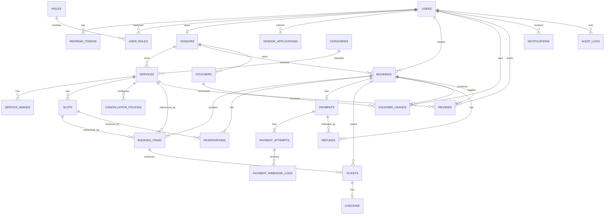

# GoBook — Domain Model

> Version: `v1.0.0-MVP`  
> Document type: Domain Model + ERD v1  
> Database: PostgreSQL  
> ORM: Prisma  
> Currency MVP: VND  
> Money storage: BIGINT  
> Primary key recommendation: UUID

---

# 1. Mục tiêu tài liệu

Tài liệu này xác định:

- Entity của hệ thống.
- Trách nhiệm của từng Entity.
- Ownership.
- Relationship.
- Cardinality.
- Aggregate boundary.
- Database constraints.
- Index.
- Snapshot strategy.
- Soft delete strategy.
- Financial invariants.
- ERD v1.

Mục tiêu cuối cùng:

> Sau tài liệu này có thể bắt đầu viết `schema.prisma` mà không cần thay đổi lớn về cấu trúc domain.

---

# 2. Domain tổng thể

GoBook MVP được chia thành các domain chính:

```text
Identity
Vendor
Catalog
Scheduling
Booking
Payment
Ticketing
Promotion
Cancellation / Refund
Review
Notification
Administration / Audit
```

Quan hệ tổng quát:

```text
User
 ├── Vendor
 │     └── Service
 │           └── Slot
 │
 └── Booking
       ├── BookingItem
       ├── Reservation
       ├── Payment
       │     ├── PaymentAttempt
       │     └── Refund
       └── Ticket
```

---

# 3. Aggregate Boundary

Không nên xem toàn bộ hệ thống là một aggregate lớn.

Đề xuất:

```text
User Aggregate

Vendor Aggregate

Service Aggregate
 └── Slot

Booking Aggregate
 ├── BookingItem
 └── Reservation

Payment Aggregate
 ├── PaymentAttempt
 └── PaymentWebhookLog

Ticket Aggregate

Voucher Aggregate
 └── VoucherUsage

Refund Aggregate

Review Aggregate

Audit Aggregate
```

---

# 4. Quy tắc ID

Khuyên dùng:

```text
UUID
```

cho tất cả entity chính.

Ví dụ:

```text
550e8400-e29b-41d4-a716-446655440000
```

Không expose auto-increment ID tuần tự ra public API nếu không cần.

---

# 5. Quy tắc thời gian

Tất cả timestamp lưu:

```text
UTC
```

Frontend convert sang timezone người dùng.

Các field phổ biến:

```text
created_at
updated_at
deleted_at
```

---

# 6. Quy tắc tiền

Tất cả tiền VND lưu:

```text
BIGINT
```

Ví dụ:

```text
199000
```

nghĩa là:

```text
199,000 VND
```

Không dùng:

```text
FLOAT
DOUBLE
```

cho monetary value.

---

# 7. Entity List

ERD v1 gồm các bảng:

```text
users
user_profiles
roles
user_roles
refresh_tokens

vendors
vendor_applications

categories
services
service_images
slots
cancellation_policies

bookings
booking_items
reservations

payments
payment_attempts
payment_webhook_logs
refunds

tickets
checkins

vouchers
voucher_usages

reviews

notifications

audit_logs
```

---

# 8. User Entity

## Table

```text
users
```

## Responsibility

Đại diện account/identity, chỉ chứa dữ liệu authentication, bảo mật và vòng đời tài khoản.

## Fields

```text
id UUID PK

email VARCHAR(320) UNIQUE NOT NULL

password_hash VARCHAR(255) NULL

status USER_STATUS NOT NULL DEFAULT ACTIVE

email_verified_at TIMESTAMP NULL

last_login_at TIMESTAMP NULL

created_at TIMESTAMP NOT NULL

updated_at TIMESTAMP NOT NULL

deleted_at TIMESTAMP NULL
```

Thông tin hiển thị không nằm trong `users`. Hồ sơ tùy chọn được lưu riêng:

```text
user_profiles

id UUID PK
user_id UUID UNIQUE NOT NULL FK -> users.id ON DELETE CASCADE
full_name VARCHAR(120) NOT NULL
phone VARCHAR(20) NULL
avatar_url VARCHAR(500) NULL
locale VARCHAR(16) NOT NULL DEFAULT 'vi-VN'
timezone VARCHAR(64) NOT NULL DEFAULT 'Asia/Ho_Chi_Minh'
created_at TIMESTAMP NOT NULL
updated_at TIMESTAMP NOT NULL
```

Cardinality: `User 1 -> 0..1 UserProfile`.

## User Status

```text
ACTIVE
SUSPENDED
DISABLED
```

---

# 9. User Role Design

MVP có:

```text
CUSTOMER
VENDOR
ADMIN
```

GoBook dùng `roles` và explicit junction table `user_roles`; không lưu role trực tiếp trong `users`. Thiết kế many-to-many này hỗ trợ trường hợp:

```text
Customer
+
Vendor
```

`CUSTOMER`, `VENDOR`, và `ADMIN` là các system role ổn định, được nhận diện bằng `roles.code` thay vì numeric ID.

---

# 10. Recommended Role Schema

```text
roles

id UUID PK
code VARCHAR(50) UNIQUE NOT NULL
name VARCHAR(100) NOT NULL
description VARCHAR(255) NULL
is_system BOOLEAN NOT NULL DEFAULT TRUE
created_at TIMESTAMP NOT NULL
updated_at TIMESTAMP NOT NULL
```

Values:

```text
CUSTOMER
VENDOR
ADMIN
```

Join table:

```text
user_roles

user_id UUID NOT NULL FK -> users.id ON DELETE CASCADE
role_id UUID NOT NULL FK -> roles.id ON DELETE RESTRICT
assigned_at TIMESTAMP NOT NULL
```

Unique:

```text
PRIMARY KEY (user_id, role_id)
```

Cardinality: `User N <-> N Role` thông qua `UserRole`. Composite primary key ngăn một role được gán trùng cho cùng user.

---

# 11. User Ownership

User sở hữu:

```text
RefreshTokens
Bookings
Reviews
VendorApplication
```

Nếu user là Vendor owner:

```text
User 1 ─── 0..1 Vendor
```

---

# 12. RefreshToken Entity

## Table

```text
refresh_tokens
```

## Purpose

Quản lý login session.

Fields:

```text
id UUID PK

user_id UUID FK

token_hash VARCHAR NOT NULL

expires_at TIMESTAMP NOT NULL

revoked_at TIMESTAMP NULL

created_at TIMESTAMP NOT NULL
```

Relation:

```text
User 1
 └── N RefreshTokens
```

Ownership:

```text
User
```

---

# 13. Vendor Entity

## Table

```text
vendors
```

## Purpose

Đại diện hồ sơ tổ chức/đơn vị kinh doanh, tách biệt hoàn toàn với `UserProfile`.
`VENDOR` role là quyền truy cập sau phê duyệt; sự tồn tại của Vendor entity không
tự động cấp role này. Vì vậy một `CUSTOMER` có thể sở hữu Vendor ở trạng thái
`DRAFT`.

Fields:

```text
id UUID PK

owner_user_id UUID FK UNIQUE

display_name VARCHAR(150) NOT NULL

slug VARCHAR(180) UNIQUE NOT NULL

description VARCHAR(1000) NULL

logo_url VARCHAR(500) NULL

legal_name VARCHAR(200) NULL

vendor_type VENDOR_TYPE NULL

tax_code VARCHAR(50) UNIQUE NULL

business_registration_number VARCHAR(100) UNIQUE NULL

legal_representative_name VARCHAR(150) NULL

contact_email VARCHAR(320) NULL

contact_phone VARCHAR(30) NULL

address_line VARCHAR(255) NULL

ward VARCHAR(100) NULL

district VARCHAR(100) NULL

province VARCHAR(100) NULL

country_code VARCHAR(2) NOT NULL DEFAULT 'VN'

status VENDOR_STATUS NOT NULL DEFAULT DRAFT

created_at TIMESTAMP NOT NULL

updated_at TIMESTAMP NOT NULL

deleted_at TIMESTAMP NULL
```

---

# 14. Vendor Status

```text
DRAFT
PENDING
APPROVED
REJECTED
SUSPENDED
```

Vendor mới được tạo với `DRAFT`. Client không được tự thay đổi status; các
transition onboarding được xử lý bởi Vendor Application flow riêng.

Vendor type:

```text
INDIVIDUAL
HOUSEHOLD_BUSINESS
COMPANY
ORGANIZATION
```

---

# 15. Vendor Cardinality

```text
User 1
 └── 0..1 Vendor
```

Trong MVP:

> Một User chỉ sở hữu tối đa một Vendor.

Constraint `UNIQUE(owner_user_id)` bảo vệ invariant này ở database.

Sau này có thể mở rộng:

```text
Organization
OrganizationMember
```

nếu nhiều nhân viên cùng quản lý Vendor.

---

# 16. Vendor Ownership

Management API resolve ownership từ database:

```text
Vendor.id → Vendor.owner_user_id → authenticated User.id
```

Không nhận owner identity từ request body/query/header. Xóa hồ sơ là soft
delete và chỉ được phép ở `DRAFT` hoặc `REJECTED`.

Vendor sở hữu:

```text
Services
Slots indirectly
Vouchers
CancellationPolicies
Bookings indirectly
```

---

# 17. VendorApplication Entity

## Table

```text
vendor_applications
```

Fields:

```text
id UUID PK

vendor_id UUID FK -> vendors.id ON DELETE RESTRICT

status VENDOR_APPLICATION_STATUS NOT NULL DEFAULT PENDING

submitted_at TIMESTAMP NOT NULL

reviewed_at TIMESTAMP NULL

reviewed_by_user_id UUID FK -> users.id ON DELETE SET NULL

review_note VARCHAR(1000) NULL

created_at TIMESTAMP NOT NULL

updated_at TIMESTAMP NOT NULL
```

`VendorApplicationStatus` chỉ gồm `PENDING`, `APPROVED`, `REJECTED`. Mỗi lần
submit hoặc resubmit tạo một row mới; application cũ không bị overwrite.

## VendorApplicationDocument

`vendor_application_documents` lưu metadata của tối đa 5 tài liệu trên mỗi
application: loại tài liệu, tên gốc, generated stored name, protected URL, MIME,
kích thước và thời gian upload. Binary được lưu ngoài PostgreSQL. Document thuộc
application với `ON DELETE CASCADE`.

## VendorApplicationHistory

`vendor_application_history` là audit trail append-only gồm `from_status`,
`to_status`, actor, note và timestamp. History thuộc application với
`ON DELETE CASCADE`; actor dùng `ON DELETE RESTRICT`.

---

# 18. VendorApplication Cardinality

```text
Vendor 1
 └── N VendorApplications

VendorApplication 1
 ├── N VendorApplicationDocuments
 └── N VendorApplicationHistoryEntries
```

Một Vendor có thể từng bị reject và submit lại. Owner được suy ra qua
`VendorApplication.vendor_id → Vendor.owner_user_id`.

Business constraint:

```text
Maximum 1 PENDING application per Vendor
```

Invariant được bảo vệ ở service và PostgreSQL partial unique index trên
`vendor_applications(vendor_id) WHERE status = 'PENDING'`.

---

# 19. Category Entity

## Table

```text
categories
```

Fields:

```text
id UUID PK

code VARCHAR(50) UNIQUE NOT NULL

name VARCHAR(120) NOT NULL

slug VARCHAR(150) UNIQUE NOT NULL

scope CATEGORY_SCOPE NOT NULL

description VARCHAR(500) NULL

icon VARCHAR(100) NULL

sort_order INT NOT NULL DEFAULT 0

is_active BOOLEAN NOT NULL DEFAULT TRUE

deleted_at TIMESTAMP NULL

created_at TIMESTAMP NOT NULL

updated_at TIMESTAMP NOT NULL
```

Scope:

```text
SERVICE
EVENT
```

`code` là machine identifier ổn định, `name` là nhãn hiển thị và `slug` là URL
identifier được tạo server-side. Rename không tự đổi code/slug. Category hiện là
flat master data; chưa có parent/subcategory. Deactivate dùng `is_active = false`;
delete là soft-delete và không xóa physical row.

---

# 20. Category Cardinality

```text
Category 1
 └── N Services
```

Service và Event dùng chung một catalog entity:

```text
Service.kind = SERVICE -> Category.scope = SERVICE
Service.kind = EVENT   -> Category.scope = EVENT
Service belongs to exactly 1 Category through category_id
```

Event schedule/occurrence được tách sang domain availability ở task sau.

---

# 21. Service Entity

## Table

```text
services
```

## Responsibility

Đại diện service hoặc event mà Vendor cung cấp.

Fields:

```text
id UUID PK

vendor_id UUID FK NOT NULL

category_id UUID FK NOT NULL

kind SERVICE_KIND NOT NULL // SERVICE | EVENT

title VARCHAR(160) NOT NULL

slug VARCHAR(200) UNIQUE NOT NULL

summary VARCHAR(300) NULL

description TEXT NULL

thumbnail_url VARCHAR(500) NULL

price_amount BIGINT NOT NULL

currency VARCHAR(3) NOT NULL DEFAULT 'VND'

duration_minutes INT NULL

status SERVICE_STATUS NOT NULL DEFAULT 'DRAFT'

published_at TIMESTAMP NULL

created_at TIMESTAMP NOT NULL

updated_at TIMESTAMP NOT NULL

deleted_at TIMESTAMP NULL
```

`ServiceKind.SERVICE` đại diện dịch vụ đặt lịch; `ServiceKind.EVENT` đại diện
event/workshop/class. Cả hai dùng cùng CRUD và catalog. `price_amount` là số nguyên
VND, được nhận và trả ở API dưới dạng chuỗi thập phân để tránh mất precision của
JavaScript. Slug được tạo server-side, unique toàn hệ thống và không đổi khi sửa
title.

---

# 22. Service Status

```text
DRAFT
PUBLISHED
HIDDEN
ARCHIVED
```

---

# 23. Service Cardinality

```text
Vendor 1
 └── N Services

Category 1
 └── N Services

Service 1
 ├── exactly 1 Category
 ├── N ServiceImages
 ├── N Slots
 ├── N Reviews (future)
 └── 0..N CancellationPolicies (future)
```

---

# 24. Service Ownership

Owner:

```text
Service.vendor_id
```

Vendor A chỉ được mutate:

```text
Service.vendor_id = VendorA.id
```

---

# 25. ServiceImage Entity

## Table

```text
service_images
```

Fields:

```text
id UUID PK

service_id UUID FK

provider VARCHAR(30) NOT NULL

storage_key VARCHAR(255) UNIQUE NOT NULL

url VARCHAR(1000) NOT NULL

original_name VARCHAR(255) NULL

mime_type VARCHAR(100) NOT NULL

file_size INT NOT NULL

width INT NULL

height INT NULL

sort_order INT NOT NULL DEFAULT 0

is_primary BOOLEAN NOT NULL DEFAULT false

created_at TIMESTAMP NOT NULL
```

Cardinality:

```text
Service 1
 └── N Images
```

PostgreSQL chỉ lưu URL công khai và metadata; binary được stream trực tiếp từ
memory tới external object/image storage:

```text
ServiceImagesService
  -> FileStorageProvider
    -> CloudinaryStorageProvider
```

`storage_key` là identifier nội bộ dùng để xóa remote asset và không xuất hiện
trong public catalog. Ảnh đầu tiên là primary; mỗi Service có tối đa một primary
theo business transaction. Khi xóa primary, ảnh có `sort_order` nhỏ nhất rồi cũ
nhất được chọn thay thế. Gallery tối đa 8 ảnh, hỗ trợ JPEG/PNG/WebP và tối đa 5 MB
mỗi file.

ServiceImage metadata có thể hard-delete sau khi remote asset đã được xóa. FK dùng
`ON DELETE CASCADE`, nhưng Service hiện soft-delete để tránh DB cascade tạo orphan
trên external storage.

Nếu Service bị soft delete:

ảnh không còn public; cleanup remote theo lifecycle/reconciliation tương lai.

---

# 26. Slot Entity

## Table

```text
slots
```

## Responsibility

Đại diện một occurrence/booking window cụ thể của Service hoặc Event.

Fields:

```text
id UUID PK

service_id UUID FK NOT NULL

start_at TIMESTAMPTZ(3) NOT NULL

end_at TIMESTAMPTZ(3) NOT NULL

capacity INT NOT NULL

price_amount BIGINT NULL

status SLOT_STATUS NOT NULL DEFAULT 'OPEN'

created_at TIMESTAMP NOT NULL

updated_at TIMESTAMP NOT NULL

deleted_at TIMESTAMP NULL
```

---

# 27. Slot Status

```text
OPEN
CLOSED
CANCELLED
```

---

# 28. Slot Constraints

Database/application constraint:

```text
start_at < end_at (PostgreSQL CHECK)

capacity BETWEEN 1 AND 100000 (PostgreSQL CHECK)

Service.kind = SERVICE và duration_minutes != null:
end_at - start_at = duration_minutes
```

Create yêu cầu `start_at > now`. Hai Slot active của cùng Service không được
overlap theo điều kiện `existing.start_at < requested.end_at AND existing.end_at
> requested.start_at`. `OPEN` và `CLOSED` đều giữ time range; `CANCELLED` và
soft-deleted Slot không chặn range. Back-to-back được phép.

`price_amount` là override tùy chọn cho từng Slot. `NULL` kế thừa
`Service.price_amount`; `0` là override miễn phí hợp lệ. Giá hiệu lực luôn được
chọn bằng null check rõ ràng, không dùng truthy/falsy. Vendor API trả cả
`priceAmount` đã cấu hình và `effectivePrice`; public API chỉ trả giá hiệu lực.
Tiền được truyền qua API bằng integer string để không mất độ chính xác.

```text
effective_price = Slot.price_amount ?? Service.price_amount
effective_currency = Service.currency
```

Chỉ Slot tương lai ở trạng thái `OPEN` hoặc `CLOSED` được đổi giá. Slot đã bắt đầu
hoặc `CANCELLED` trả conflict giống các thay đổi Slot khác.

Application serialize create/update theo Service để tránh race giữa các API write.
Database chưa có exclusion constraint, nên direct/out-of-band database writes vẫn
phải tự tuân thủ overlap invariant.

---

# 29. Slot Cardinality

```text
Service 1
 └── N Slots

Slot 1
 ├── N BookingItems (future)
 └── N Reservations (future)
```

---

# 30. Slot Capacity Design

Không lưu:

```text
available_capacity
remaining_capacity
booked_count
```

vì dễ bị lệch dữ liệu.

Khuyên tính:

```text
available
=
capacity
-
confirmed quantity
-
active reservation quantity
```

`capacity` chỉ là maximum bookable capacity. Công thức remaining chỉ được triển
khai khi Reservation/Booking trở thành source of truth; API Slot hiện không trả số
ghế còn lại giả bằng capacity. Nếu cần optimization sau này mới denormalize.

---

# 31. CancellationPolicy Entity

## Table

```text
cancellation_policies
```

MVP có thể thiết kế policy ở cấp:

```text
Service
```

Fields:

```text
id UUID PK

service_id UUID FK

name VARCHAR

is_active BOOLEAN

created_at

updated_at
```

Các rule có thể dùng JSON:

```text
rules JSONB
```

Ví dụ:

```json
[
  {
    "beforeHours": 24,
    "refundPercent": 100
  },
  {
    "beforeHours": 0,
    "refundPercent": 50
  }
]
```

---

# 32. Cancellation Snapshot

Không reference policy live từ Booking.

Booking phải snapshot:

```text
cancellation_policy_snapshot JSONB
```

khi confirm.

Lý do:

Vendor thay policy không được ảnh hưởng booking cũ.

---

# 33. Booking Entity

## Table

```text
bookings
```

Đây là một trong các bảng quan trọng nhất.

Fields:

```text
id UUID PK

code VARCHAR UNIQUE NOT NULL

customer_id UUID FK NOT NULL

vendor_id UUID FK NOT NULL

status BOOKING_STATUS NOT NULL

currency VARCHAR NOT NULL DEFAULT 'VND'

subtotal BIGINT NOT NULL

discount_amount BIGINT NOT NULL DEFAULT 0

gross_amount BIGINT NOT NULL

commission_rate DECIMAL NOT NULL

platform_fee BIGINT NOT NULL

vendor_amount BIGINT NOT NULL

voucher_id UUID FK NULL

expires_at TIMESTAMP NULL

confirmed_at TIMESTAMP NULL

completed_at TIMESTAMP NULL

cancelled_at TIMESTAMP NULL

cancellation_policy_snapshot JSONB NULL

created_at TIMESTAMP

updated_at TIMESTAMP
```

---

# 34. Booking Status

```text
HELD
PENDING_PAYMENT
CONFIRMED
COMPLETED
CANCELLED
EXPIRED
```

Không cần:

```text
PAID
```

vì đó là Payment state.

---

# 35. Booking Ownership

Customer owner:

```text
booking.customer_id
```

Vendor relation:

```text
booking.vendor_id
```

Admin không sở hữu booking.

Admin chỉ có management permission.

---

# 36. Booking Cardinality

```text
User 1
 └── N Bookings

Vendor 1
 └── N Bookings

Booking 1
 ├── N BookingItems
 ├── 1..N Reservations
 ├── 1 Payment
 ├── N Tickets
 └── 0..N Refunds
```

---

# 37. Booking Vendor Constraint

Trong MVP khuyên một Booking chỉ chứa item của:

```text
one Vendor
```

Không cho cart chứa nhiều Vendor.

Lý do:

đơn giản hóa:

```text
payment
commission
refund
cancellation policy
vendor settlement
```

Multi-vendor cart để v2.

---

# 38. BookingItem Entity

## Table

```text
booking_items
```

Fields:

```text
id UUID PK

booking_id UUID FK NOT NULL

service_id UUID FK NOT NULL

slot_id UUID FK NOT NULL

service_name_snapshot VARCHAR NOT NULL

slot_start_snapshot TIMESTAMP NOT NULL

slot_end_snapshot TIMESTAMP NOT NULL

unit_price BIGINT NOT NULL

currency VARCHAR(3) NOT NULL

pricing_source VARCHAR NOT NULL

quantity INT NOT NULL

subtotal BIGINT NOT NULL

price_captured_at TIMESTAMP NOT NULL

created_at TIMESTAMP
```

---

# 39. BookingItem Snapshot

BookingItem phải snapshot:

```text
service name
slot time
unit price
currency và nguồn giá (`SLOT` hoặc `SERVICE`)
thời điểm capture giá
```

Không chỉ reference live data.

Nếu Vendor đổi Service sau đó:

Booking history vẫn chính xác.

Pricing foundation hiện phân giải giá từ Slot + Service trong database và tạo
snapshot bất biến gồm `unitPriceAmount`, `currency`, `quantity`,
`subtotalAmount`, `pricingSource`, `capturedAt`. Persistence của snapshot sẽ được
tích hợp khi domain Reservation/Booking được implement; schema runtime hiện chưa
có các model này.

Trong flow Booking tương lai, resolve giá và persist snapshot phải nằm trong cùng
transaction với Reservation/Booking creation để tránh khoảng trễ giữa đọc giá và
ghi booking. Không recalculation snapshot lịch sử khi giá Service hoặc Slot đổi.

---

# 40. BookingItem Cardinality

```text
Booking 1
 └── N BookingItems
```

MVP thực tế có thể ban đầu:

```text
1 Booking
=
1 BookingItem
```

nhưng schema vẫn nên hỗ trợ nhiều item.

---

# 41. Reservation Entity

## Table

```text
reservations
```

Fields:

```text
id UUID PK

booking_id UUID FK NOT NULL

slot_id UUID FK NOT NULL

quantity INT NOT NULL

status RESERVATION_STATUS NOT NULL

expires_at TIMESTAMP NOT NULL

consumed_at TIMESTAMP NULL

released_at TIMESTAMP NULL

created_at TIMESTAMP

updated_at TIMESTAMP
```

---

# 42. Reservation Status

```text
ACTIVE
CONSUMED
EXPIRED
RELEASED
```

---

# 43. Reservation Ownership

Reservation không trực tiếp thuộc Customer.

Ownership được suy ra:

```text
Reservation
→ Booking
→ Customer
```

---

# 44. Reservation Cardinality

```text
Booking 1
 └── N Reservations

Slot 1
 └── N Reservations
```

---

# 45. Reservation Invariant

Bắt buộc:

```text
confirmed quantity
+
ACTIVE reservation quantity
<=
Slot.capacity
```

Đây là invariant quan trọng nhất của Booking Engine.

---

# 46. Payment Entity

## Table

```text
payments
```

Fields:

```text
id UUID PK

booking_id UUID FK UNIQUE NOT NULL

provider PAYMENT_PROVIDER NOT NULL

status PAYMENT_STATUS NOT NULL

amount BIGINT NOT NULL

currency VARCHAR NOT NULL

successful_attempt_id UUID NULL

paid_at TIMESTAMP NULL

created_at TIMESTAMP

updated_at TIMESTAMP
```

---

# 47. Payment Provider

MVP:

```text
VNPAY
```

Schema vẫn dùng enum để sau này mở rộng:

```text
MOMO
ZALOPAY
STRIPE
```

---

# 48. Payment Status

```text
INITIATED
PENDING
SUCCESS
FAILED
EXPIRED
NEEDS_REVIEW
REFUND_PENDING
PARTIAL_REFUNDED
REFUNDED
```

---

# 49. Booking ↔ Payment Cardinality

MVP:

```text
Booking 1
 └── 0..1 Payment
```

Payment:

```text
Payment 1
 └── N PaymentAttempts
```

Điều này tốt hơn tạo một Payment mới mỗi lần retry.

---

# 50. PaymentAttempt Entity

## Table

```text
payment_attempts
```

Fields:

```text
id UUID PK

payment_id UUID FK NOT NULL

provider VARCHAR NOT NULL

request_reference VARCHAR UNIQUE NOT NULL

gateway_transaction_id VARCHAR NULL

amount BIGINT NOT NULL

status PAYMENT_ATTEMPT_STATUS NOT NULL

payment_url TEXT NULL

failure_code VARCHAR NULL

failure_message TEXT NULL

requested_at TIMESTAMP NOT NULL

completed_at TIMESTAMP NULL

created_at TIMESTAMP
```

---

# 51. PaymentAttempt Status

```text
CREATED
PENDING
SUCCESS
FAILED
EXPIRED
NEEDS_REVIEW
```

---

# 52. PaymentAttempt Cardinality

```text
Payment 1
 └── N PaymentAttempts
```

Ví dụ:

```text
Payment
 ├── Attempt #1 FAILED
 ├── Attempt #2 FAILED
 └── Attempt #3 SUCCESS
```

---

# 53. Payment Gateway Idempotency

Index/constraint:

```text
gateway_transaction_id UNIQUE
```

nếu non-null.

Mục tiêu:

không process cùng gateway transaction hai lần.

---

# 54. PaymentWebhookLog Entity

## Table

```text
payment_webhook_logs
```

Fields:

```text
id UUID PK

provider VARCHAR NOT NULL

payment_id UUID FK NULL

payment_attempt_id UUID FK NULL

transaction_reference VARCHAR NULL

gateway_transaction_id VARCHAR NULL

payload JSONB NOT NULL

signature_valid BOOLEAN NOT NULL

processing_status WEBHOOK_STATUS NOT NULL

error_code VARCHAR NULL

error_message TEXT NULL

received_at TIMESTAMP NOT NULL

processed_at TIMESTAMP NULL
```

---

# 55. Webhook Status

```text
RECEIVED
PROCESSED
IGNORED_DUPLICATE
REJECTED
FAILED
```

---

# 56. Webhook Cardinality

```text
PaymentAttempt 1
 └── N WebhookLogs
```

Duplicate webhook được phép tồn tại trong log.

Business side-effect mới phải idempotent.

---

# 57. Refund Entity

## Table

```text
refunds
```

Fields:

```text
id UUID PK

booking_id UUID FK NOT NULL

payment_id UUID FK NOT NULL

amount BIGINT NOT NULL

type REFUND_TYPE NOT NULL

status REFUND_STATUS NOT NULL

reason TEXT NULL

gateway_ref VARCHAR NULL

requested_by UUID FK users.id NULL

processed_at TIMESTAMP NULL

created_at TIMESTAMP

updated_at TIMESTAMP
```

---

# 58. Refund Type

```text
FULL
PARTIAL
```

---

# 59. Refund Status

```text
PENDING
PROCESSING
SUCCESS
FAILED
```

---

# 60. Refund Cardinality

```text
Booking 1
 └── N Refunds

Payment 1
 └── N Refunds
```

Không assume chỉ có một refund.

Có thể có:

```text
partial refund #1
partial refund #2
```

trong tương lai.

---

# 61. Refund Invariant

Tổng refund thành công:

```text
SUM(successful refunds)
<=
Payment.amount
```

Không refund vượt số đã thanh toán.

---

# 62. Ticket Entity

## Table

```text
tickets
```

Fields:

```text
id UUID PK

booking_id UUID FK NOT NULL

booking_item_id UUID FK NOT NULL

token VARCHAR UNIQUE NOT NULL

status TICKET_STATUS NOT NULL

checked_in_at TIMESTAMP NULL

created_at TIMESTAMP

updated_at TIMESTAMP
```

---

# 63. Ticket Status

```text
ACTIVE
CHECKED_IN
CANCELLED
EXPIRED
```

---

# 64. Ticket Cardinality

```text
Booking 1
 └── N Tickets

BookingItem 1
 └── N Tickets
```

Nếu:

```text
quantity = 3
```

khuyên tạo:

```text
3 Tickets
```

---

# 65. Ticket Ownership

Ticket owner suy ra:

```text
Ticket
→ Booking
→ Customer
```

Vendor được check-in nếu:

```text
Booking.vendor_id = authenticated Vendor.id
```

---

# 66. Checkin Entity

Có thể chỉ lưu:

```text
tickets.checked_in_at
```

nhưng khuyên tạo bảng:

```text
checkins
```

để audit tốt hơn.

Fields:

```text
id UUID PK

ticket_id UUID FK UNIQUE NOT NULL

vendor_id UUID FK NOT NULL

checked_in_by UUID FK users.id NOT NULL

checked_in_at TIMESTAMP NOT NULL

metadata JSONB NULL
```

---

# 67. Checkin Cardinality

```text
Ticket 1
 └── 0..1 Checkin
```

Unique:

```text
ticket_id
```

giúp chống duplicate check-in ở DB level.

---

# 68. Voucher Entity

## Table

```text
vouchers
```

Fields:

```text
id UUID PK

vendor_id UUID FK NULL

code VARCHAR UNIQUE NOT NULL

type VOUCHER_TYPE NOT NULL

value BIGINT / DECIMAL NOT NULL

max_discount BIGINT NULL

min_order_value BIGINT NOT NULL DEFAULT 0

usage_limit INT NULL

per_user_limit INT NULL

start_at TIMESTAMP NOT NULL

end_at TIMESTAMP NOT NULL

status VOUCHER_STATUS NOT NULL

created_at TIMESTAMP

updated_at TIMESTAMP
```

---

# 69. Voucher Ownership

Nếu:

```text
vendor_id != null
```

thì voucher thuộc Vendor.

Nếu:

```text
vendor_id = null
```

có thể đại diện platform voucher.

MVP có thể chỉ cho:

```text
Vendor Voucher
```

nếu muốn đơn giản hơn.

---

# 70. Voucher Type

```text
FIXED
PERCENTAGE
```

---

# 71. Voucher Status

```text
ACTIVE
INACTIVE
EXPIRED
```

Expired có thể suy ra bằng time thay vì persist.

---

# 72. VoucherUsage Entity

## Table

```text
voucher_usages
```

Fields:

```text
id UUID PK

voucher_id UUID FK

user_id UUID FK

booking_id UUID FK UNIQUE

discount_amount BIGINT NOT NULL

created_at TIMESTAMP
```

---

# 73. VoucherUsage Cardinality

```text
Voucher 1
 └── N VoucherUsages

User 1
 └── N VoucherUsages

Booking 1
 └── 0..1 VoucherUsage
```

MVP:

```text
one voucher per booking
```

---

# 74. Voucher Concurrency

`usage_limit` không được chỉ:

```text
COUNT then INSERT
```

không lock.

Phải concurrency-safe.

Có thể dùng:

```text
transaction
+
row lock voucher
+
count usage
+
insert usage
```

hoặc atomic counter strategy.

---

# 75. Review Entity

## Table

```text
reviews
```

Fields:

```text
id UUID PK

booking_id UUID FK UNIQUE NOT NULL

service_id UUID FK NOT NULL

user_id UUID FK NOT NULL

rating SMALLINT NOT NULL

comment TEXT NULL

status REVIEW_STATUS NOT NULL

created_at TIMESTAMP

updated_at TIMESTAMP
```

---

# 76. Review Constraints

```text
rating >= 1
rating <= 5
```

Unique:

```text
booking_id
```

Business rule:

```text
Booking.status = COMPLETED
```

---

# 77. Review Cardinality

```text
Service 1
 └── N Reviews

User 1
 └── N Reviews

Booking 1
 └── 0..1 Review
```

---

# 78. Notification Entity

## Table

```text
notifications
```

Fields:

```text
id UUID PK

user_id UUID FK

type NOTIFICATION_TYPE

channel NOTIFICATION_CHANNEL

title VARCHAR

content TEXT

status NOTIFICATION_STATUS

sent_at TIMESTAMP NULL

created_at TIMESTAMP
```

---

# 79. Notification Channel

MVP:

```text
EMAIL
```

Có thể chuẩn bị enum:

```text
EMAIL
SMS
PUSH
IN_APP
```

---

# 80. AuditLog Entity

## Table

```text
audit_logs
```

Fields:

```text
id UUID PK

actor_user_id UUID FK NULL

action VARCHAR(100) NOT NULL

entity_type VARCHAR(100) NOT NULL

entity_id VARCHAR(100) NOT NULL

target_user_id UUID NULL

metadata JSONB NULL

ip_address VARCHAR(64) NULL

user_agent VARCHAR(500) NULL

created_at TIMESTAMP NOT NULL
```

`actor_user_id` tham chiếu `users.id` với `ON DELETE SET NULL`, để sự kiện vẫn
được giữ khi tài khoản actor bị xóa. Các index phục vụ điều tra theo actor,
action, `(entity_type, entity_id)` và thời gian tạo.

`VendorApplicationHistory` là timeline nghiệp vụ của riêng application;
`AuditLog` là dấu vết quản trị tổng quát. Approve/reject Vendor ghi cả hai trong
cùng transaction. Audit log là append-only và không có API update/delete.

---

# 81. Audit Cardinality

Audit log không nhất thiết FK cứng tới mọi entity.

Dùng:

```text
entity_type
entity_id
```

để generic.

Ví dụ:

```text
entity_type = "VENDOR_APPLICATION"
entity_id = "..."
```

---

# 82. Main Ownership Matrix

| Entity | Owner |
|---|---|
| User | Self |
| RefreshToken | User |
| Vendor | owner_user_id |
| VendorApplication | Vendor → owner_user_id |
| VendorApplicationDocument | VendorApplication → Vendor |
| VendorApplicationHistory | VendorApplication → Vendor / changed_by_user_id actor |
| Service | Vendor |
| ServiceImage | Service → Vendor |
| Slot | Service → Vendor |
| CancellationPolicy | Service → Vendor |
| Booking | Customer |
| BookingItem | Booking |
| Reservation | Booking |
| Payment | Booking |
| PaymentAttempt | Payment |
| WebhookLog | System |
| Refund | Booking / System |
| Ticket | Booking Customer |
| Checkin | Vendor |
| Voucher | Vendor / Platform |
| VoucherUsage | User + Booking |
| Review | Customer |
| Notification | User |
| AuditLog | System |

---

# 83. Main Relationship Matrix

| Parent | Relation | Child | Cardinality |
|---|---|---|---|
| User | has | RefreshToken | 1:N |
| User | owns | Vendor | 1:0..1 |
| Vendor | has | VendorApplication | 1:N |
| VendorApplication | has | VendorApplicationDocument | 1:N |
| VendorApplication | has | VendorApplicationHistory | 1:N |
| Vendor | owns | Service | 1:N |
| Category | classifies | Service | 1:N |
| Service | has | ServiceImage | 1:N |
| Service | has | Slot | 1:N |
| Service | has | CancellationPolicy | 1:N |
| User | creates | Booking | 1:N |
| Vendor | receives | Booking | 1:N |
| Booking | has | BookingItem | 1:N |
| Slot | referenced by | BookingItem | 1:N |
| Booking | has | Reservation | 1:N |
| Slot | receives | Reservation | 1:N |
| Booking | has | Payment | 1:0..1 |
| Payment | has | PaymentAttempt | 1:N |
| PaymentAttempt | has | WebhookLog | 1:N |
| Booking | has | Ticket | 1:N |
| Ticket | has | Checkin | 1:0..1 |
| Booking | has | Refund | 1:N |
| Payment | has | Refund | 1:N |
| Vendor | owns | Voucher | 1:N |
| Voucher | has | VoucherUsage | 1:N |
| User | has | VoucherUsage | 1:N |
| Booking | uses | VoucherUsage | 1:0..1 |
| Service | has | Review | 1:N |
| Booking | produces | Review | 1:0..1 |

---

# 84. ERD v1



---

# 85. Simplified Core ERD

Phần quan trọng nhất cần hiểu trước khi code:

```text
User
 │
 │ 1:N
 ▼
Booking
 │
 ├──────────────┐
 │              │
 ▼              ▼
BookingItem   Reservation
 │              │
 │              ▼
 ▼             Slot
Slot
 │
 ▼
Service
 │
 ▼
Vendor


Booking
 │
 │ 1:1
 ▼
Payment
 │
 │ 1:N
 ▼
PaymentAttempt
 │
 ▼
WebhookLog


Booking
 │
 │ 1:N
 ▼
Ticket
 │
 │ 1:0..1
 ▼
Checkin
```

---

# 86. Booking Aggregate

Booking Aggregate:

```text
Booking
 ├── BookingItem
 └── Reservation
```

BookingService chịu trách nhiệm:

```text
create hold
price snapshot
voucher application
capacity reservation
expiration
booking transitions
```

Payment không nên bị nhét toàn bộ logic vào BookingService.

---

# 87. Payment Aggregate

```text
Payment
 └── PaymentAttempt
```

PaymentService chịu trách nhiệm:

```text
create payment
create attempt
verify callback
idempotency
payment transition
```

Khi Payment success:

Payment domain phát signal / gọi application service để:

```text
confirm Booking
consume Reservation
generate Ticket
```

---

# 88. Ticket Aggregate

```text
Ticket
 └── Checkin
```

TicketService xử lý:

```text
generate ticket
verify token
check ownership
check-in
duplicate check-in prevention
```

---

# 89. Cross Aggregate Transaction

Một số thao tác bắt buộc transaction.

## Create Reservation

```text
Lock Slot
↓
Check Capacity
↓
Create Booking
↓
Create BookingItem
↓
Create Reservation
↓
Commit
```

---

# 90. Payment Confirmation Transaction

```text
Verify callback outside / before critical transaction

BEGIN

Lock Payment

Check already processed

Payment SUCCESS

Booking CONFIRMED

Reservation CONSUMED

Create Ticket(s)

COMMIT
```

---

# 91. Cancellation Transaction

```text
BEGIN

Lock Booking

Validate state

Calculate refund

Booking CANCELLED

Tickets CANCELLED

Create Refund

COMMIT
```

Gateway refund call không nên giữ DB transaction mở quá lâu.

Khuyên:

```text
DB transaction
↓
Refund PENDING
↓
Commit
↓
Async gateway refund
```

---

# 92. Database Foreign Key Strategy

Nên dùng FK thật cho các relation quan trọng.

Ví dụ:

```text
service.vendor_id
→ vendors.id

slot.service_id
→ services.id

booking.customer_id
→ users.id

payment.booking_id
→ bookings.id
```

---

# 93. Delete Strategy

Không `ON DELETE CASCADE` tùy tiện với financial/history tables.

Đặc biệt:

```text
Bookings
Payments
Tickets
Refunds
AuditLogs
```

không được bị mất vì User/Service bị xóa.

Khuyên:

```text
RESTRICT
```

hoặc soft delete.

---

# 94. Safe Cascade Cases

Có thể cascade:

```text
RefreshTokens
```

khi xóa thật User trong dev/test.

Có thể cascade:

```text
ServiceImages
```

nếu Service chưa có history và bị xóa vật lý.

Production vẫn ưu tiên soft delete.

---

# 95. Soft Delete Entities

Khuyên dùng `deleted_at` cho:

```text
users
vendors
services
slots
```

Không cần soft delete cho:

```text
payment_webhook_logs
audit_logs
```

vì chúng là immutable history.

---

# 96. Immutable / Append-only Data

Nên gần như immutable:

```text
payment_webhook_logs
audit_logs
payment_attempts after completion
voucher_usages
checkins
```

Không nên cho admin edit trực tiếp.

---

# 97. Important Unique Constraints

```text
users.email UNIQUE

roles.code UNIQUE

vendors.owner_user_id UNIQUE

categories.code UNIQUE

categories.slug UNIQUE

services.slug UNIQUE

bookings.code UNIQUE

payment_attempts.request_reference UNIQUE

payment_attempts.gateway_transaction_id UNIQUE WHERE NOT NULL

tickets.token UNIQUE

checkins.ticket_id UNIQUE

vouchers.code UNIQUE

voucher_usages.booking_id UNIQUE

reviews.booking_id UNIQUE
```

---

# 98. Important Indexes

## Users

```text
users(email)
```

## Services

```text
services(vendor_id)
services(category_id)
services(status)
services(slug)
```

## Slots

```text
slots(service_id)
slots(start_at)
slots(service_id, start_at)
slots(status)
slots(service_id, status, start_at)
```

## Bookings

```text
bookings(customer_id)
bookings(vendor_id)
bookings(status)
bookings(code)
bookings(created_at)
```

## Reservations

```text
reservations(slot_id)
reservations(status)
reservations(expires_at)
reservations(slot_id, status)
```

## Payments

```text
payments(booking_id)
payments(status)
```

## Attempts

```text
payment_attempts(payment_id)
payment_attempts(gateway_transaction_id)
payment_attempts(request_reference)
```

## Tickets

```text
tickets(token)
tickets(booking_id)
tickets(status)
```

## Vouchers

```text
vouchers(code)
vouchers(vendor_id)
```

---

# 99. Reservation Query Requirement

Capacity calculation phải tìm nhanh:

```text
slot_id
+
status = ACTIVE
+
expires_at > now
```

Nên index:

```text
(slot_id, status, expires_at)
```

---

# 100. Financial Snapshot

Booking phải snapshot ít nhất:

```text
subtotal
discount_amount
gross_amount
commission_rate
platform_fee
vendor_amount
```

BookingItem:

```text
unit_price
subtotal
service_name
slot_start
slot_end
```

---

# 101. Financial Invariant

Luôn đúng:

```text
gross_amount
=
subtotal
-
discount_amount
```

và:

```text
vendor_amount
=
gross_amount
-
platform_fee
```

---

# 102. Non-negative Money Constraint

Phải đảm bảo:

```text
subtotal >= 0
discount_amount >= 0
gross_amount >= 0
platform_fee >= 0
vendor_amount >= 0
refund.amount >= 0
```

---

# 103. Discount Invariant

```text
discount_amount
<=
subtotal
```

Không cho:

```text
gross_amount < 0
```

---

# 104. Booking Code

Không dùng UUID trực tiếp cho UI nếu muốn UX tốt.

Tạo code:

```text
GB-20260916-AB12CD
```

hoặc:

```text
GB-X92K31
```

`id` vẫn là UUID.

---

# 105. Public Token vs Internal ID

Ticket QR dùng:

```text
token
```

không dùng:

```text
ticket.id
```

trực tiếp nếu token dễ đoán.

---

# 106. PII Consideration

PII chính:

```text
email
phone
full_name
address
vendor documents
```

Không duplicate PII quá nhiều vào:

```text
payment
ticket
webhook
```

trừ snapshot thực sự cần.

---

# 107. Webhook Payload

Payload gateway có thể chứa sensitive metadata.

Nên lưu:

```text
JSONB
```

nhưng mask field nếu cần trước logging.

Webhook raw data:

không được trả public API cho Customer/Vendor.

---

# 108. Domain Rule — Vendor

```text
Vendor.status = APPROVED
```

mới được:

```text
publish Service
create public Slots
receive new bookings
```

---

# 109. Domain Rule — Service

Service public khi:

```text
status = PUBLISHED
```

và:

```text
vendor.status = APPROVED
```

---

# 110. Domain Rule — Slot

Slot bookable khi:

```text
status = OPEN

end_at > now

Service = PUBLISHED

Vendor = APPROVED
```

---

# 111. Domain Rule — Booking

Booking confirm khi:

```text
verified Payment SUCCESS
```

Không confirm từ:

```text
browser return URL
```

---

# 112. Domain Rule — Reservation

Reservation ACTIVE chỉ hợp lệ khi:

```text
expires_at > now
```

Nếu job bị trễ nhưng:

```text
expires_at <= now
```

thì availability calculation phải coi reservation đó là expired.

Không phụ thuộc hoàn toàn BullMQ.

---

# 113. Domain Rule — Payment

Một Payment chỉ có:

```text
at most one successful attempt
```

Nếu có attempt success sau khi một attempt khác đã success:

```text
NEEDS_REVIEW
```

---

# 114. Domain Rule — Ticket

Ticket chỉ tạo nếu:

```text
Booking.status = CONFIRMED
```

---

# 115. Domain Rule — Review

Review chỉ tạo nếu:

```text
Booking.status = COMPLETED
```

và:

```text
Booking.customer_id = User.id
```

---

# 116. Entity Lifecycle Summary

```text
User
ACTIVE
↓
can become Vendor


VendorApplication
PENDING
↓
APPROVED / REJECTED


Vendor
PENDING
↓
APPROVED
↓
SUSPENDED


Service
DRAFT
↓
PUBLISHED
↓
HIDDEN / ARCHIVED


Reservation
ACTIVE
↓
CONSUMED / EXPIRED / RELEASED


Booking
HELD
↓
PENDING_PAYMENT
↓
CONFIRMED
↓
COMPLETED

or

EXPIRED

or

CANCELLED


Payment
INITIATED
↓
PENDING
↓
SUCCESS

or

FAILED / EXPIRED / NEEDS_REVIEW


Ticket
ACTIVE
↓
CHECKED_IN

or

CANCELLED


Refund
PENDING
↓
PROCESSING
↓
SUCCESS / FAILED
```

---

# 117. Core Entity Dependency

Thứ tự migration hợp lý:

```text
users
roles
user_roles

refresh_tokens

vendors
vendor_applications

categories

services
service_images

slots
cancellation_policies

vouchers

bookings
booking_items
reservations
voucher_usages

payments
payment_attempts
payment_webhook_logs

tickets
checkins

refunds

reviews
notifications
audit_logs
```

---

# 118. Suggested Prisma Modules

Có thể chia schema logical theo module:

```text
Identity

User
Role
UserRole
RefreshToken


Vendor

Vendor
VendorApplication


Catalog

Category
Service
ServiceImage
Slot
CancellationPolicy


Booking

Booking
BookingItem
Reservation


Payment

Payment
PaymentAttempt
PaymentWebhookLog
Refund


Ticket

Ticket
Checkin


Promotion

Voucher
VoucherUsage


Engagement

Review
Notification


System

AuditLog
```

---

# 119. Tables quan trọng nhất

Nếu cần ưu tiên review schema kỹ nhất:

```text
slots

bookings

booking_items

reservations

payments

payment_attempts

payment_webhook_logs

tickets

refunds
```

Đây là các bảng ảnh hưởng trực tiếp đến:

```text
capacity
money
payment
ticket
```

---

# 120. Không nên gộp

Không nên gộp:

```text
Booking + Payment
```

vì lifecycle khác nhau.

Không nên gộp:

```text
Booking + Reservation
```

vì Reservation là temporary resource lock.

Không nên gộp:

```text
Payment + PaymentAttempt
```

vì một booking có thể retry nhiều lần.

Không nên gộp:

```text
Ticket + Checkin
```

nếu muốn audit rõ.

---

# 121. Không cần tách quá mức

Không cần tạo riêng:

```text
ServiceAddress
CustomerAddress
TicketQr
SlotPrice
```

trong MVP nếu chưa có requirement rõ.

Tránh over-engineering.

---

# 122. Main Domain Invariants

## INV-01

```text
active reservations
+
confirmed bookings
<= slot capacity
```

## INV-02

Một gateway transaction chỉ có một business effect.

## INV-03

Booking CONFIRMED phải có Payment SUCCESS.

## INV-04

Payment amount = Booking gross amount.

## INV-05

Ticket chỉ thuộc confirmed/completed booking.

## INV-06

Ticket chỉ có tối đa một Checkin.

## INV-07

Refund successful total <= Payment amount.

## INV-08

Voucher usage không vượt usage limit.

## INV-09

Customer chỉ sở hữu booking của chính họ.

## INV-10

Vendor chỉ mutate resource thuộc Vendor đó.

---

# 123. ERD v1 Completion Criteria

ERD v1 được xem là hoàn thành khi:

- [x] User model rõ.
- [x] Role model rõ.
- [x] Vendor model rõ.
- [x] Service model rõ.
- [x] Slot model rõ.
- [x] Booking model rõ.
- [x] Reservation model rõ.
- [x] Payment model rõ.
- [x] PaymentAttempt model rõ.
- [x] Ticket model rõ.
- [x] Refund model rõ.
- [x] Voucher model rõ.
- [x] Review model rõ.
- [x] Ownership xác định.
- [x] Cardinality xác định.
- [x] Snapshot strategy xác định.
- [x] Unique constraints xác định.
- [x] Index strategy cơ bản xác định.
- [x] Soft delete strategy xác định.
- [x] Financial invariant xác định.

---

# 124. Final Core Model

Mô hình cốt lõi của GoBook v1:

```text
USER
 │
 ├───────────────┐
 │               │
 ▼               ▼
VENDOR         BOOKING
 │               │
 ▼               ├───────────────┐
SERVICE           │               │
 │                ▼               ▼
 ▼           BOOKING_ITEM    RESERVATION
SLOT               │               │
 ▲                 └──────┬────────┘
 │                        │
 └────────────────────────┘


BOOKING
   │
   ▼
PAYMENT
   │
   ▼
PAYMENT_ATTEMPT
   │
   ▼
WEBHOOK_LOG


BOOKING
   │
   ▼
TICKET
   │
   ▼
CHECKIN


BOOKING
   │
   ▼
REFUND
```

---

# 125. Final Design Principle

Domain model của GoBook phải bảo vệ ba loại dữ liệu quan trọng nhất:

```text
CAPACITY
MONEY
HISTORY
```

Capacity không được oversell.

Money không được tính sai hoặc xử lý hai lần.

History không được thay đổi chỉ vì Vendor chỉnh dữ liệu hiện tại.

Nếu ba nguyên tắc này được giữ đúng thì ERD v1 đủ ổn định để bắt đầu triển khai database và Booking Engine.

---

# 126. Booking Schema Foundation Update

Migration `booking_schema` implements the Booking foundation for the next
Reservation Hold and Capacity Enforcement task. This is intentionally narrower
than the full future marketplace model: no Payment, Ticket, Refund, Voucher,
Commission, or cancellation policy tables are added here.

## Implemented aggregate

```text
User(Customer)
  1:N
Booking

Vendor
  1:N
Booking

Booking
  1:N
BookingItem

BookingItem
  1:1
Reservation

Service
  1:N
BookingItem

Slot
  1:N
BookingItem

Slot
  1:N
Reservation
```

MVP rule: one Booking belongs to one Vendor. A Booking can contain multiple
BookingItems, but every item must resolve to the same `Booking.vendorId`.
Database foreign keys protect direct relationships; the one-vendor invariant is
an application/domain invariant checked by future booking creation logic.

## Booking

`bookings` stores the customer-facing aggregate:

```text
id UUID PK
booking_code VARCHAR(30) UNIQUE
customer_id UUID FK -> users.id ON DELETE RESTRICT
vendor_id UUID FK -> vendors.id ON DELETE RESTRICT
status BookingStatus DEFAULT PENDING_PAYMENT
currency VARCHAR(3) DEFAULT 'VND'
subtotal_amount BIGINT CHECK >= 0
total_amount BIGINT CHECK >= 0
expires_at TIMESTAMPTZ NULL
confirmed_at TIMESTAMPTZ NULL
cancelled_at TIMESTAMPTZ NULL
expired_at TIMESTAMPTZ NULL
idempotency_key VARCHAR(100) NULL
created_at TIMESTAMPTZ
updated_at TIMESTAMPTZ
```

Indexes cover customer list, vendor list, status filters, and created-time
ordering. `(customer_id, idempotency_key)` is unique so future POST retries can
return the same booking instead of creating duplicate holds. Multiple null
idempotency keys remain possible with PostgreSQL semantics.

`booking_code` is public/customer-friendly and unique, but UUID remains the
database identifier.

## BookingItem

`booking_items` exists because a Booking may contain multiple slots/items while
still remaining one Vendor in MVP. It also stores immutable historical
snapshots:

```text
service_title_snapshot
slot_start_at_snapshot
slot_end_at_snapshot
unit_price_amount
quantity
subtotal_amount
currency
pricing_source
```

Vendor changes to Service title, Service price, Slot price, or Slot time must
not mutate existing BookingItem history. `subtotal_amount =
unit_price_amount * quantity` is calculated by future creation logic using
BigInt arithmetic.

## Reservation

`reservations` is the capacity allocation record:

```text
booking_item_id UUID UNIQUE FK -> booking_items.id ON DELETE CASCADE
slot_id UUID FK -> slots.id ON DELETE RESTRICT
quantity INT CHECK > 0
status ReservationStatus DEFAULT HELD
expires_at TIMESTAMPTZ NULL
confirmed_at TIMESTAMPTZ NULL
released_at TIMESTAMPTZ NULL
```

`Reservation.quantity` intentionally mirrors `BookingItem.quantity` so future
capacity queries can aggregate by `slot_id` without loading BookingItem rows.
Future creation transactions must guarantee equality.

Capacity formula for the next task:

```text
consumedCapacity =
SUM Reservation.quantity
WHERE slot_id = target
AND (
  status = CONFIRMED
  OR (status = HELD AND expires_at > now)
)

available = Slot.capacity - consumedCapacity
```

A `HELD` reservation with `expires_at <= now` must not count as active capacity,
even if a cleanup job has not yet changed the status to `EXPIRED`.

No `remainingCapacity` is added to Slot and Slot capacity is not decremented.

## Implemented hold capacity protocol

`POST /api/v1/bookings/hold` is implemented as the first capacity writer.

Inside one PostgreSQL transaction it:

```text
read DB NOW()
lock requested Slot rows in deterministic UUID order
lock related Service rows in deterministic UUID order
validate public bookability
sum active capacity allocations from reservations
create Booking PENDING_PAYMENT
create BookingItems with immutable price/title/time snapshots
create Reservations HELD
commit
```

Active capacity remains:

```text
Reservation.status = CONFIRMED
OR
Reservation.status = HELD AND Reservation.expires_at > database NOW()
```

Future operations that change capacity allocation should follow the same Slot
locking protocol, including release, cancellation, expiration finalization, and
capacity-changing Slot updates. PostgreSQL remains the source of truth; Redis is
not authoritative for capacity.

## Implemented expiration finalization protocol

Reservation hold expiration is finalized by an internal backend worker. The
business deadline remains the persisted `Booking.expires_at` /
`Reservation.expires_at` timestamp. Redis TTL is not authoritative.

Eligibility:

```text
Booking.status = PENDING_PAYMENT
AND Booking.expires_at IS NOT NULL
AND Booking.expires_at <= database NOW()
```

The worker processes bounded batches using:

```text
ORDER BY expires_at ASC, id ASC
LIMIT BOOKING_EXPIRATION_BATCH_SIZE
FOR UPDATE SKIP LOCKED
```

Inside one transaction it locks/re-checks Booking rows first, transitions
eligible Reservation rows from `HELD` to `EXPIRED`, then transitions the Booking
from `PENDING_PAYMENT` to `EXPIRED` and sets `expired_at = database NOW()`.
`CONFIRMED`, `RELEASED`, and already `EXPIRED` reservations are not modified.

Capacity release does not require a Slot update:

```text
HELD AND expires_at > database NOW()   => consumes capacity
HELD AND expires_at <= database NOW()  => does not consume capacity
EXPIRED                                => does not consume capacity
RELEASED                               => does not consume capacity
```

Therefore if a hold expires at `14:10:00` and the worker runs at `14:10:45`,
new hold capacity is already available during the lag window. The worker only
finalizes stale state for lifecycle clarity.

For all future Booking lifecycle writes, the locking order contract is:

```text
lock/re-check Booking
then mutate related Reservations
```

Future payment initiation must require:

```text
Booking.status = PENDING_PAYMENT
AND Booking.expires_at > database NOW()
```

## Delete strategy

Business records should not normally be physically deleted. Foreign keys from
User, Vendor, Service, and Slot use `RESTRICT`. `Booking -> BookingItem` and
`BookingItem -> Reservation` use `CASCADE` to keep test cleanup and aggregate
cleanup coherent; the application must not expose hard-delete Booking APIs.
