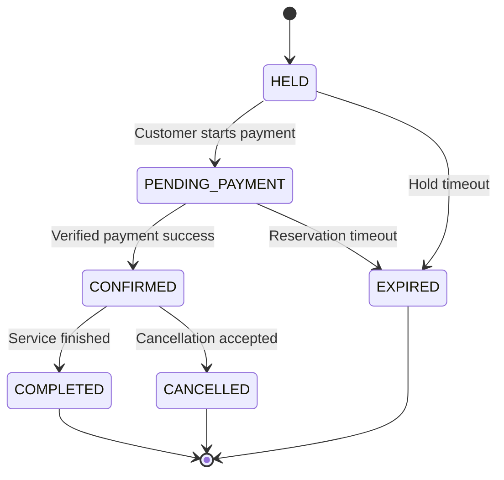
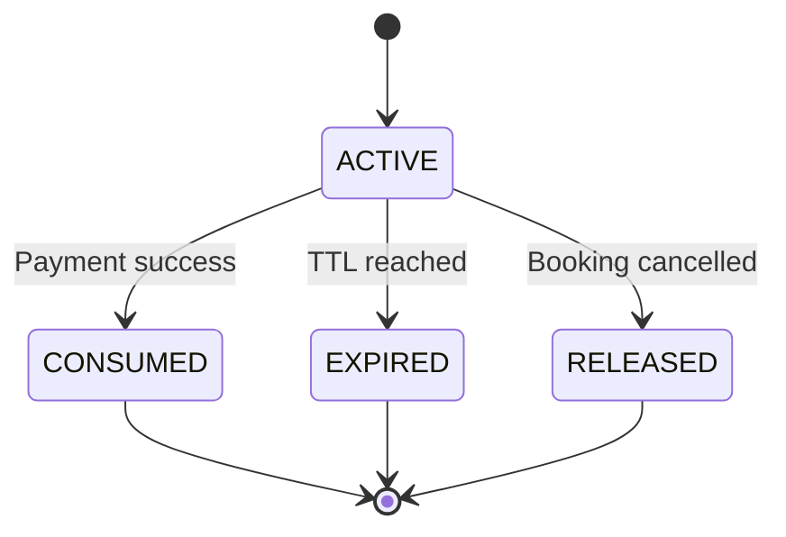
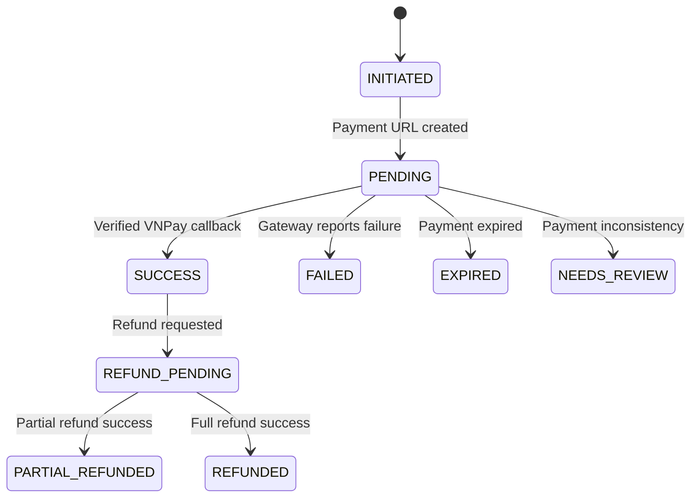
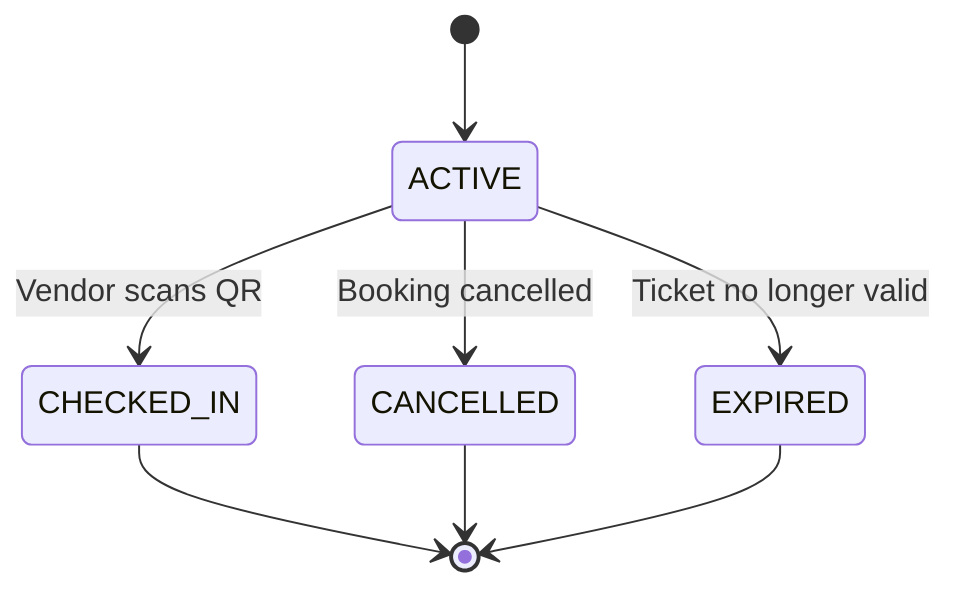
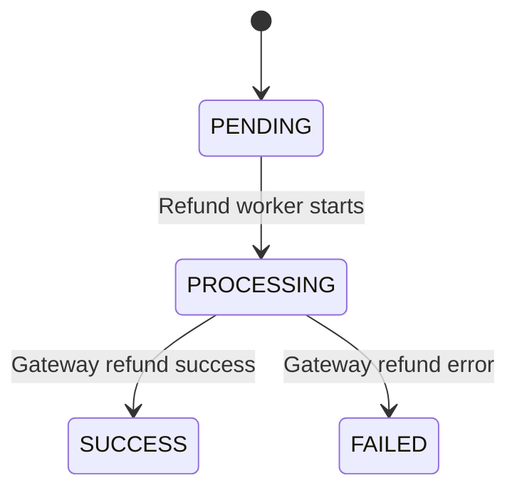

# GoBook — State Machine

> Version: `v1.0.0-MVP`
> Mục tiêu: Xác định trạng thái và cách chuyển trạng thái của các domain quan trọng trong GoBook.

---

# 1. Vì sao cần State Machine?

Trong GoBook, một đối tượng không chỉ có trạng thái:

```text
PENDING
SUCCESS
FAILED
```

Mỗi domain có lifecycle riêng.

Ví dụ:

```text
Booking Status
Payment Status
Reservation Status
Ticket Status
Refund Status
```

Phải tách riêng để tránh logic bị lẫn.

---

# 2. Booking State Machine

## States

```text
HELD
PENDING_PAYMENT
CONFIRMED
COMPLETED
CANCELLED
EXPIRED
```

## Flow chính

```text
HELD
  ↓
PENDING_PAYMENT
  ↓
CONFIRMED
  ↓
COMPLETED
```

Các nhánh khác:

```text
HELD
  ↓
EXPIRED
```

```text
PENDING_PAYMENT
  ↓
EXPIRED
```

```text
CONFIRMED
  ↓
CANCELLED
```

---

## Mermaid



---

# 3. Booking Transition Rules

## HELD → PENDING_PAYMENT

Khi:

```text
Customer bắt đầu thanh toán.
```

Điều kiện:

```text
Reservation ACTIVE
expires_at > now
```

---

## HELD → EXPIRED

Khi:

```text
Reservation hết thời gian giữ chỗ.
```

---

## PENDING_PAYMENT → CONFIRMED

Chỉ khi:

```text
VNPay callback hợp lệ
+
signature đúng
+
amount đúng
+
payment chưa được xử lý
```

Không được confirm booking từ:

```text
Return URL
```

---

## PENDING_PAYMENT → EXPIRED

Khi:

```text
Reservation hết hạn trước khi thanh toán được xác nhận.
```

---

## CONFIRMED → COMPLETED

Khi:

```text
Slot đã kết thúc.
```

Có thể do scheduled job thực hiện.

---

## CONFIRMED → CANCELLED

Khi:

```text
Customer hủy hợp lệ
```

hoặc:

```text
Vendor/Admin hủy theo business rule.
```

---

# 4. Reservation State Machine

## States

```text
ACTIVE
CONSUMED
EXPIRED
RELEASED
```

Flow:

```text
ACTIVE
 ├──→ CONSUMED
 ├──→ EXPIRED
 └──→ RELEASED
```

---

## Mermaid



---

# 5. Reservation Rules

## ACTIVE → CONSUMED

Khi:

```text
Booking được CONFIRMED.
```

Nghĩa là chỗ giữ tạm đã trở thành booking thật.

---

## ACTIVE → EXPIRED

Khi:

```text
expires_at <= now
```

Capacity được trả lại.

---

## ACTIVE → RELEASED

Khi:

```text
Booking bị hủy trước khi reservation được consume.
```

---

# 6. Payment State Machine

## States

```text
INITIATED
PENDING
SUCCESS
FAILED
EXPIRED
NEEDS_REVIEW
REFUND_PENDING
PARTIAL_REFUNDED
REFUNDED
```

Flow chính:

```text
INITIATED
   ↓
PENDING
   ↓
SUCCESS
```

Failure:

```text
PENDING
 ├──→ FAILED
 ├──→ EXPIRED
 └──→ NEEDS_REVIEW
```

Refund:

```text
SUCCESS
  ↓
REFUND_PENDING
  ↓
PARTIAL_REFUNDED
```

hoặc:

```text
SUCCESS
  ↓
REFUND_PENDING
  ↓
REFUNDED
```

---

# 7. Payment Mermaid



---

# 8. NEEDS_REVIEW dùng khi nào?

Không nên cố tự động xử lý những case nguy hiểm.

Ví dụ:

```text
Payment callback đến sau khi Booking đã EXPIRED
```

hoặc:

```text
VNPay amount != Booking amount
```

hoặc:

```text
Nhiều payment attempt đều báo SUCCESS
```

Khi đó:

```text
Payment → NEEDS_REVIEW
```

Admin kiểm tra sau.

---

# 9. PaymentAttempt State Machine

Một Payment có thể có nhiều attempt.

States:

```text
CREATED
PENDING
SUCCESS
FAILED
EXPIRED
NEEDS_REVIEW
```

Ví dụ:

```text
Payment

Attempt 1 → FAILED
Attempt 2 → FAILED
Attempt 3 → SUCCESS
```

Payment cuối cùng:

```text
SUCCESS
```

---

# 10. Ticket State Machine

## States

```text
ACTIVE
CHECKED_IN
CANCELLED
EXPIRED
```

Flow:

```text
ACTIVE
 ├──→ CHECKED_IN
 ├──→ CANCELLED
 └──→ EXPIRED
```

---

## Mermaid



---

# 11. Ticket Rules

## ACTIVE → CHECKED_IN

Điều kiện:

```text
Booking CONFIRMED
Ticket belongs to Vendor
Ticket ACTIVE
```

---

## ACTIVE → CANCELLED

Khi:

```text
Booking CANCELLED
```

---

## CHECKED_IN

Không được:

```text
CHECKED_IN → ACTIVE
```

trong flow thông thường.

Nếu scan lại:

```text
ALREADY_CHECKED_IN
```

---

# 12. Refund State Machine

States:

```text
PENDING
PROCESSING
SUCCESS
FAILED
```

Flow:

```text
PENDING
   ↓
PROCESSING
   ├──→ SUCCESS
   └──→ FAILED
```

---

## Mermaid



---

# 13. Refund Rule quan trọng

Nếu refund:

```text
FAILED
```

thì Booking vẫn:

```text
CANCELLED
```

Ticket vẫn:

```text
CANCELLED
```

Không restore booking tự động.

---

## Vendor Profile Lifecycle

Vendor profile được tạo ở trạng thái:

```text
DRAFT
```

Trong Vendor Profile CRUD, status là read-only và không có transition. Các
transition `DRAFT → PENDING → APPROVED/REJECTED` thuộc Vendor Application flow.

---

# 14. Vendor Application State Machine

States:

```text
PENDING
APPROVED
REJECTED
```

Flow:

```text
PENDING
 ├──→ APPROVED
 └──→ REJECTED
```

Nếu rejected:

User có thể sửa và tạo application mới.

---

# 15. Service State Machine

States:

```text
DRAFT
PUBLISHED
HIDDEN
ARCHIVED
```

Flow phổ biến:

```text
DRAFT
  ↓
PUBLISHED
  ↓
HIDDEN
```

Có thể:

```text
HIDDEN
  ↓
PUBLISHED
```

hoặc:

```text
PUBLISHED
  ↓
ARCHIVED
```

---

# 16. Slot State Machine

States:

```text
AVAILABLE
DISABLED
CLOSED
```

Flow:

```text
AVAILABLE
  ↓
DISABLED
```

hoặc khi slot đã kết thúc:

```text
AVAILABLE
  ↓
CLOSED
```

---

# 17. State Machine liên kết với nhau

Đây là phần quan trọng nhất.

```text
Reservation ACTIVE
        ↓

Booking HELD
        ↓

Booking PENDING_PAYMENT
        ↓

Payment SUCCESS
        ↓

Booking CONFIRMED
        ↓

Reservation CONSUMED
        ↓

Ticket ACTIVE
```

---

# 18. Payment Success Transaction

Khi callback thanh toán hợp lệ:

```text
BEGIN TRANSACTION

Payment
PENDING → SUCCESS

Booking
PENDING_PAYMENT → CONFIRMED

Reservation
ACTIVE → CONSUMED

Create Ticket
ACTIVE

COMMIT
```

Các state phải thay đổi cùng nhau.

---

# 19. Expiration Flow

Nếu hold hết hạn:

```text
Reservation
ACTIVE → EXPIRED

Booking
HELD / PENDING_PAYMENT → EXPIRED
```

Không tạo Ticket.

---

# 20. Cancellation Flow

Khi hủy booking:

```text
Booking
CONFIRMED → CANCELLED

Ticket
ACTIVE → CANCELLED

Refund
→ PENDING
```

Sau đó refund được xử lý async.

---

# 21. Trạng thái không được phép

Không cho:

```text
EXPIRED → CONFIRMED
```

Không cho:

```text
CANCELLED → CONFIRMED
```

Không cho:

```text
CHECKED_IN → ACTIVE
```

Không cho:

```text
FAILED Payment → SUCCESS
```

nếu cùng attempt đã kết thúc và callback không hợp lệ.

Không cho:

```text
COMPLETED → CANCELLED
```

trong customer flow MVP.

---

# 22. Backend phải kiểm tra Transition

Không làm:

```typescript
booking.status = input.status
```

từ frontend.

Frontend không được tự quyết định status.

Backend phải có logic kiểu:

```text
confirmBooking()
cancelBooking()
expireBooking()
completeBooking()
```

Thay vì:

```text
updateBookingStatus(status)
```

---

# 23. Ví dụ Transition Guard

Ví dụ cancel booking:

```text
IF booking.status != CONFIRMED
    reject

IF service already started
    reject

calculate refund

Booking → CANCELLED
```

---

# 24. State và HTTP Error

Nếu transition không hợp lệ:

```text
409 CONFLICT
```

Ví dụ:

```json
{
  "statusCode": 409,
  "code": "INVALID_BOOKING_STATE",
  "message": "Booking cannot be cancelled from current state"
}
```

---

# 25. State Logging

Các transition quan trọng nên log:

```text
Booking:
PENDING_PAYMENT → CONFIRMED

Payment:
PENDING → SUCCESS

Reservation:
ACTIVE → CONSUMED

Ticket:
ACTIVE → CHECKED_IN
```

Log nên chứa:

```text
entityId
fromState
toState
requestId
actor
timestamp
```

---

# 26. Critical State Invariants

Luôn đúng:

```text
Booking CONFIRMED
→ Payment SUCCESS
```

```text
Ticket ACTIVE
→ Booking CONFIRMED
```

```text
Ticket CHECKED_IN
→ Booking CONFIRMED or COMPLETED
```

```text
Reservation CONSUMED
→ Booking CONFIRMED
```

```text
Booking EXPIRED
→ Reservation must not remain ACTIVE
```

---

# 27. Core State Summary

```text
BOOKING

HELD
→ PENDING_PAYMENT
→ CONFIRMED
→ COMPLETED

HELD / PENDING_PAYMENT
→ EXPIRED

CONFIRMED
→ CANCELLED
```

```text
RESERVATION

ACTIVE
→ CONSUMED

ACTIVE
→ EXPIRED

ACTIVE
→ RELEASED
```

```text
PAYMENT

INITIATED
→ PENDING
→ SUCCESS

PENDING
→ FAILED / EXPIRED / NEEDS_REVIEW
```

```text
TICKET

ACTIVE
→ CHECKED_IN

ACTIVE
→ CANCELLED
```

```text
REFUND

PENDING
→ PROCESSING
→ SUCCESS / FAILED
```

---

# 28. Nguyên tắc cuối cùng

Không xem:

```text
Booking
Payment
Reservation
Ticket
```

là cùng một state machine.

Chúng liên quan với nhau nhưng có lifecycle riêng.

Backend phải đảm bảo:

```text
VALID TRANSITION
+
DATABASE TRANSACTION
+
IDEMPOTENCY
```

để các trạng thái luôn đồng bộ và không phát sinh lỗi booking hoặc thanh toán.

Đây là State Machine chính thức cho **GoBook MVP v1.0.0**.
