# GoBook — User Flow & Business Flows

> Version: `v1.0.0-MVP`  
> Document type: User Journey + Business Flow + Error Flow  
> Product: GoBook  
> Actors: Customer / Vendor / Admin  
> Payment gateway: VNPay  
> Source of truth: PostgreSQL  
> Async processing: Redis + BullMQ

---

# 1. Mục đích tài liệu

Tài liệu này mô tả toàn bộ hành trình người dùng trong GoBook trước khi bắt đầu triển khai.

Mục tiêu:

- Làm rõ Customer làm gì.
- Làm rõ Vendor làm gì.
- Làm rõ Admin làm gì.
- Xác định điểm bắt đầu và kết thúc của từng flow.
- Xác định happy path.
- Xác định alternative path.
- Xác định error path.
- Xác định business rules.
- Xác định trạng thái của Booking, Payment, Reservation và Ticket.
- Xác định quyền truy cập giữa các role.
- Làm nền cho API design.
- Làm nền cho UI design.
- Làm nền cho test case.
- Làm nền cho GitHub backlog.

---

# 2. Actors

GoBook MVP có ba actor chính.

```text
CUSTOMER
VENDOR
ADMIN
```

---

# 3. Customer

Customer là người sử dụng cuối cùng.

Customer có thể:

```text
Register
Login
Search Service
View Service
View Slot
Hold Slot
Apply Voucher
Create Booking
Pay
View Booking
View Ticket
Cancel Booking
Track Refund
Review Service
```

---

# 4. Vendor

Vendor là đơn vị cung cấp dịch vụ hoặc tổ chức sự kiện.

Vendor có thể:

```text
Register
Apply Vendor
Manage Vendor Profile
Create Service
Create Slot
Configure Price
Configure Cancellation Policy
View Bookings
Check-in Customer
Create Voucher
View Dashboard
```

Vendor chỉ hoạt động đầy đủ khi:

```text
Vendor.status = APPROVED
```

---

# 5. Admin

Admin vận hành nền tảng.

Admin có thể:

```text
Approve Vendor
Reject Vendor
Manage Categories
Inspect Booking
Inspect Payment
Inspect Refund
Inspect Webhook
Monitor Transactions
```

---

# 6. System Boundary

GoBook tương tác với:

```text
Customer Browser
Vendor Browser
Admin Browser

        ↓

Next.js Frontend

        ↓

NestJS API

        ↓

PostgreSQL
Redis
BullMQ
Object Storage

        ↓

VNPay
Email Provider
```

---

# 7. Tổng quan hành trình Customer

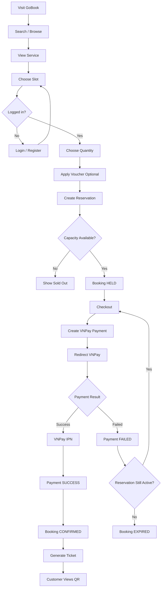

---

# 8. Customer Journey — Discover Service

## Entry Point

Customer truy cập:

```text
/
```

hoặc:

```text
/services
```

Customer không bắt buộc login để browse.

---

# 9. Customer — Search

Customer có thể search bằng:

```text
keyword
category
date
minPrice
maxPrice
location
```

System chỉ hiển thị:

```text
Service.status = PUBLISHED
Vendor.status = APPROVED
```

Service bị:

```text
DRAFT
HIDDEN
ARCHIVED
```

không xuất hiện trong public search.

---

# 10. Happy Path — Search

```text
Customer
↓
Enter keyword
↓
Apply filters
↓
GET /services
↓
System query database
↓
Return matching services
↓
Customer selects service
```

---

# 11. Error Path — Search

## Không có kết quả

System trả:

```text
results = []
```

UI hiển thị:

```text
Không tìm thấy dịch vụ phù hợp.
```

Không xem đây là system error.

---

# 12. Service Detail Flow

Customer mở:

```text
/services/{slug}
```

System trả:

```text
service
vendor basic info
category
images
available slots
price
review summary
cancellation information
```

---

# 13. Service Detail Business Rules

Customer chỉ xem được nếu:

```text
service.status = PUBLISHED
vendor.status = APPROVED
```

Nếu:

```text
service.status = HIDDEN
```

thì trả:

```text
404
```

thay vì tiết lộ resource tồn tại nhưng bị ẩn.

---

# 14. Slot Availability Flow

Customer chọn ngày.

Frontend gọi:

```text
GET /services/{serviceId}/slots
```

System chỉ trả:

```text
future slot
AVAILABLE
not disabled
```

Available quantity:

```text
capacity
-
confirmed_quantity
-
active_reservation_quantity
```

---

# 15. Slot Availability Important Rule

Frontend hiển thị:

```text
Còn 2 chỗ
```

chỉ mang tính tham khảo.

Frontend không phải source of truth.

Availability cuối cùng chỉ được xác định khi:

```text
POST /bookings/hold
```

thực hiện transaction trong database.

---

# 16. Customer Login Flow

Customer có thể browse không cần account.

Account bắt buộc tại thời điểm:

```text
Create Reservation
```

Nếu chưa login:

```text
Select slot
↓
Login required
↓
Login/Register
↓
Return to checkout context
```

---

# 17. Register Happy Path

```text
Customer
↓
Enter Email
↓
Enter Password
↓
Enter Name
↓
POST /auth/register
↓
Validate
↓
Hash Password
↓
Create User
↓
CUSTOMER Role
↓
Return Tokens
```

---

# 18. Register Error Paths

## Email tồn tại

```text
409 EMAIL_ALREADY_EXISTS
```

## Email không hợp lệ

```text
400 INVALID_EMAIL
```

## Password không đạt rule

```text
400 INVALID_PASSWORD
```

## Database error

```text
500 INTERNAL_ERROR
```

Không expose:

```text
SQL
stack trace
DB connection string
```

---

# 19. Login Happy Path

```text
Customer
↓
Email + Password
↓
POST /auth/login
↓
Find User
↓
Compare Password
↓
Issue Access Token
↓
Issue Refresh Token
↓
Login Success
```

---

# 20. Login Error Path

Email hoặc password sai:

```text
401 INVALID_CREDENTIALS
```

Không trả:

```text
EMAIL_NOT_FOUND
```

hoặc:

```text
PASSWORD_WRONG
```

nhằm tránh user enumeration.

---

# 21. Booking Entry Flow

Customer:

```text
Select Slot
↓
Select Quantity
↓
Optional Voucher
↓
Continue
```

Frontend có thể tính preview.

Tuy nhiên backend luôn tính lại:

```text
unit price
subtotal
voucher
discount
total
commission
```

---

# 22. Booking Hold Request

Request:

```http
POST /bookings/hold
```

Input:

```json
{
  "slotId": "...",
  "quantity": 2,
  "voucherCode": "WELCOME10"
}
```

Frontend tuyệt đối không gửi:

```text
totalAmount
finalPrice
platformFee
vendorAmount
```

như dữ liệu đáng tin cậy.

---

# 23. Hold Reservation — Happy Path

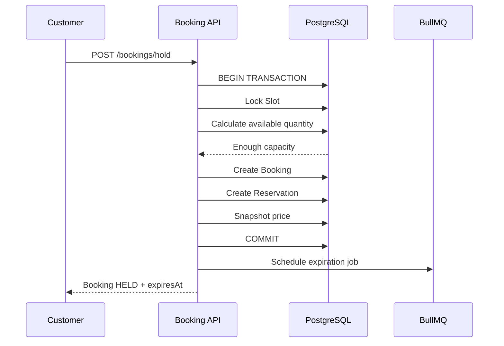

---

# 24. Hold Business Rules

System phải validate:

```text
Customer authenticated
Service published
Vendor approved
Slot exists
Slot active
Slot future
Quantity > 0
Capacity enough
Voucher valid if provided
```

---

# 25. Hold Error — Insufficient Capacity

Ví dụ:

```text
available = 2
quantity requested = 3
```

Response:

```text
409 INSUFFICIENT_CAPACITY
```

UI:

```text
Chỉ còn 2 chỗ.
```

---

# 26. Hold Error — Concurrent Booking

Scenario:

```text
capacity = 1

Customer A
Customer B
```

cùng request.

Database lock hoặc atomic update đảm bảo:

```text
A SUCCESS
B SOLD_OUT
```

hoặc ngược lại.

Không bao giờ:

```text
A SUCCESS
B SUCCESS
```

---

# 27. Reservation Lifecycle

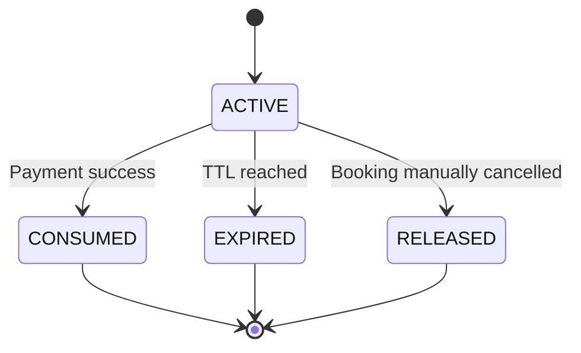

---

# 28. Booking Hold Screen

Sau khi hold thành công:

Frontend hiển thị:

```text
Booking Code
Service
Slot
Quantity
Subtotal
Voucher
Discount
Total
Expiration countdown
```

Ví dụ:

```text
09:59
09:58
09:57
```

---

# 29. Booking Expiration Flow

Reservation default:

```text
10 minutes
```

Flow:

```text
Reservation created
↓
BullMQ delayed job scheduled
↓
TTL reached
↓
Worker fetch reservation
↓
Check current state
```

Nếu:

```text
ACTIVE
```

thì:

```text
Reservation → EXPIRED
Booking → EXPIRED
```

---

# 30. Expiration Race Condition

Scenario:

```text
Payment callback
```

và:

```text
Expiration job
```

xảy ra gần như cùng lúc.

Cả hai phải kiểm tra trạng thái trong transaction.

Không được:

```text
Booking CONFIRMED
+
Reservation EXPIRED
```

đồng thời.

---

# 31. Checkout Flow

Customer nhấn:

```text
Thanh toán
```

Backend kiểm tra lại:

```text
booking belongs customer
booking HELD/PENDING_PAYMENT
reservation active
expiresAt > now
amount > 0
```

Sau đó:

```text
Create Payment
Create PaymentAttempt
Generate VNPay URL
Booking → PENDING_PAYMENT
```

---

# 32. VNPay Flow

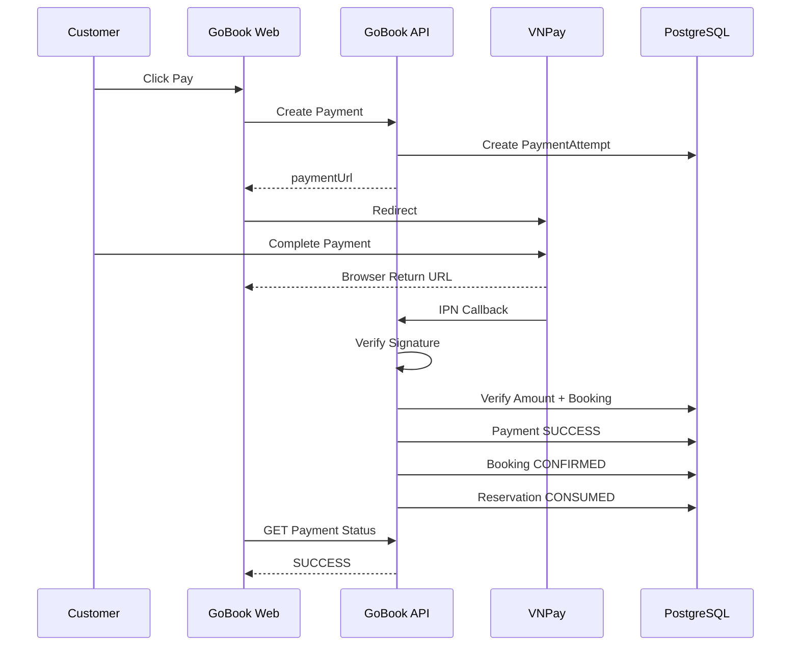

---

# 33. Payment Return URL

Browser return:

```text
/payment/result
```

không phải nguồn xác nhận thanh toán.

Frontend:

```text
Read payment reference
↓
Call backend
↓
GET latest status
↓
Render result
```

---

# 34. Payment Happy Path

VNPay IPN tới backend.

Backend:

```text
Verify Signature
↓
Find PaymentAttempt
↓
Verify Amount
↓
Verify Booking
↓
Check Idempotency
↓
Start Transaction
↓
Payment SUCCESS
↓
Booking CONFIRMED
↓
Reservation CONSUMED
↓
Generate Tickets
↓
Commit
```

---

# 35. Payment Failed Path

VNPay báo thất bại.

Backend:

```text
PaymentAttempt → FAILED
```

Reservation:

```text
ACTIVE
```

nếu chưa hết TTL.

UI có thể hiển thị:

```text
Thanh toán thất bại.
Bạn còn 04:32 để thử lại.
```

---

# 36. Payment Retry Flow

Nếu:

```text
Reservation ACTIVE
expiresAt > now
```

Customer được:

```text
Create new PaymentAttempt
```

Không tạo Booking mới.

Structure:

```text
Booking #GB001
 ├── Attempt 1 FAILED
 ├── Attempt 2 FAILED
 └── Attempt 3 SUCCESS
```

---

# 37. Payment Timeout

Nếu Customer:

```text
rời VNPay
đóng tab
không thanh toán
```

thì reservation vẫn sống đến:

```text
expiresAt
```

Sau đó:

```text
Booking EXPIRED
Reservation EXPIRED
```

---

# 38. Duplicate VNPay IPN

VNPay có thể callback:

```text
3 lần
```

Backend:

```text
Receive IPN
↓
Check gatewayTransactionId
↓
Already processed?
```

Nếu yes:

```text
Return success acknowledgement
No business side effect
```

Không:

```text
create ticket again
increase revenue again
confirm booking again
```

---

# 39. Wrong Amount Error

Booking:

```text
500000
```

VNPay callback:

```text
400000
```

System:

```text
DO NOT CONFIRM
```

Payment:

```text
NEEDS_REVIEW
```

Webhook log:

```text
AMOUNT_MISMATCH
```

Admin có thể inspect.

---

# 40. Invalid Signature Error

Webhook signature sai:

```text
signatureValid = false
```

System:

```text
No state change
```

Log callback.

---

# 41. Late Payment Success

Scenario:

```text
10:00 Booking created
10:10 Booking expired
10:11 Slot sold to Customer B
10:12 VNPay success callback for Customer A
```

Không được:

```text
Confirm Customer A
```

vì sẽ oversell.

System:

```text
Payment / Attempt = NEEDS_REVIEW
Booking remains EXPIRED
Admin notified/logged
```

Sau MVP có thể tự refund.

---

# 42. Booking State Machine

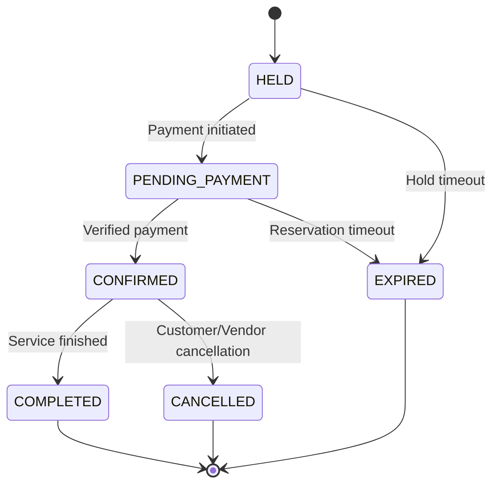

---

# 43. Ticket Generation Flow

Booking CONFIRMED:

```text
Payment Success
↓
Booking CONFIRMED
↓
Create Ticket
↓
Generate Token
↓
Generate QR
↓
Ticket ACTIVE
```

Nếu quantity:

```text
2
```

thì MVP có thể chọn:

```text
2 tickets
```

khuyên dùng cách này.

---

# 44. Ticket QR

QR chứa:

```text
ticket token
```

Không chứa:

```text
phone
email
payment amount
customer sensitive information
```

---

# 45. Customer Ticket Journey

Customer mở:

```text
/my-bookings
```

Chọn booking:

```text
Booking Detail
↓
Tickets
↓
Open Ticket
↓
Show QR
```

---

# 46. Ticket Detail

Hiển thị:

```text
Ticket Code
Service
Slot
Venue
Status
QR
Booking Code
```

Không cần hiển thị payment secret hoặc gateway data.

---

# 47. Vendor Check-in Journey

```text
Vendor Login
↓
Open Check-in
↓
Scan QR
↓
Send token
↓
Validate
↓
Confirm Customer
```

---

# 48. Check-in Happy Path

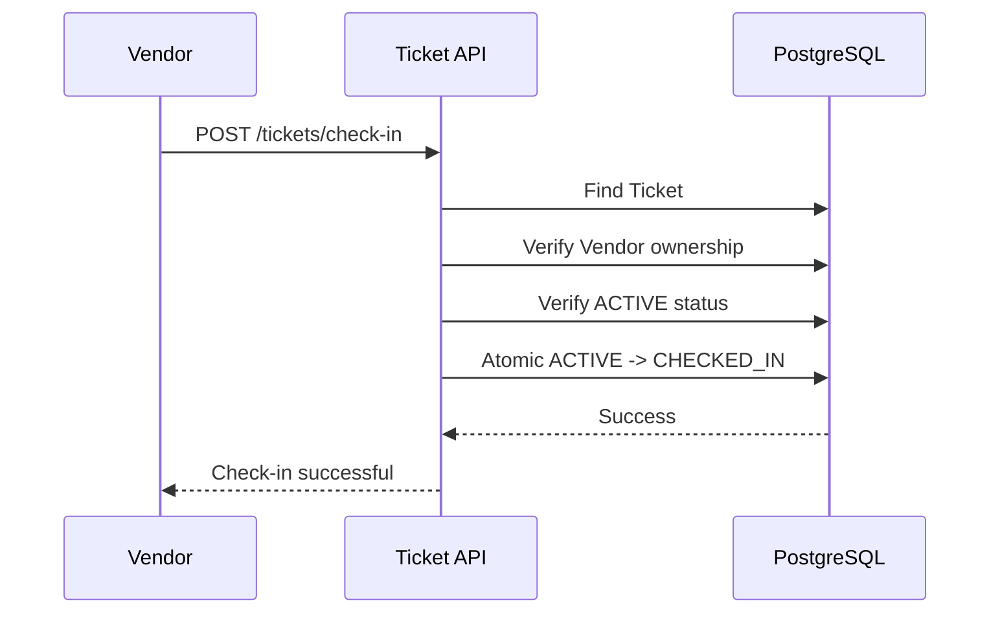

---

# 49. Invalid Ticket Error

Token không tồn tại:

```text
404 INVALID_TICKET
```

---

# 50. Wrong Vendor Check-in

Ticket thuộc:

```text
Vendor A
```

Vendor B scan:

```text
403 TICKET_NOT_OWNED
```

Không được leak customer data.

---

# 51. Duplicate Check-in

Ticket:

```text
CHECKED_IN
```

scan lại:

```text
409 ALREADY_CHECKED_IN
```

UI hiển thị:

```text
Vé đã được check-in lúc 18:32.
```

---

# 52. Concurrent Scan

Hai device scan cùng ticket.

Atomic transition:

```text
UPDATE tickets
SET status = CHECKED_IN
WHERE id = ?
AND status = ACTIVE
```

Chỉ một request:

```text
affected rows = 1
```

Request còn lại:

```text
ALREADY_CHECKED_IN
```

---

# 53. Customer Cancellation Journey

```text
My Bookings
↓
Booking Detail
↓
Cancel Booking
↓
Display Refund Policy
↓
Customer Confirm
↓
Calculate Refund
↓
Cancel Booking
↓
Cancel Ticket
↓
Create Refund
```

---

# 54. Cancellation Eligibility

Customer có thể cancel nếu:

```text
Booking = CONFIRMED
```

và policy cho phép.

Không thể cancel:

```text
EXPIRED
COMPLETED
already CANCELLED
```

---

# 55. Cancellation Policy Example

```text
>= 24h before slot:
100%

< 24h:
50%

After slot start:
0%
```

---

# 56. Policy Snapshot

Nếu Vendor thay policy sau khi Customer booking:

booking cũ vẫn dùng:

```text
policy snapshot
```

tại thời điểm booking được xác nhận.

---

# 57. Cancellation Happy Path

Ví dụ:

```text
Booking Total = 500,000

Cancel = 30h before event

Policy = 100%
```

System:

```text
Refund Amount = 500,000
```

Transition:

```text
Booking CONFIRMED
↓
CANCELLED

Ticket ACTIVE
↓
CANCELLED

Refund
↓
PENDING
```

---

# 58. Partial Refund

Ví dụ:

```text
500,000
```

cancel 12h trước:

```text
50%
```

Refund:

```text
250,000
```

Không tính bằng frontend.

---

# 59. Cancellation Error — Too Late

Policy:

```text
0% after event start
```

System có thể vẫn cho cancel record:

```text
Booking CANCELLED
Refund Amount = 0
```

hoặc không cho cancel.

MVP nên chọn:

```text
Không cho customer cancel sau khi service bắt đầu.
```

---

# 60. Refund Journey

```text
Cancellation approved
↓
Create Refund
↓
PENDING
↓
PROCESSING
↓
SUCCESS / FAILED
```

---

# 61. Refund Failure

Nếu gateway refund lỗi:

```text
Refund FAILED
```

Booking vẫn:

```text
CANCELLED
```

Ticket vẫn:

```text
CANCELLED
```

Admin cần thấy refund failed để xử lý lại.

---

# 62. Customer Review Journey

Sau khi:

```text
Booking COMPLETED
```

Customer thấy:

```text
Đánh giá dịch vụ
```

---

# 63. Review Business Rules

Review chỉ được tạo nếu:

```text
booking.customer_id = current user
booking.status = COMPLETED
```

Một booking:

```text
max 1 review
```

Rating:

```text
1..5
```

---

# 64. Customer End-to-End Happy Path

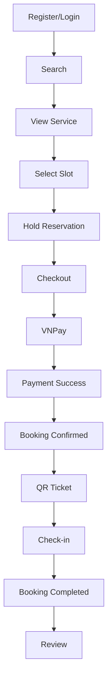

---

# 65. Tổng quan Vendor Journey

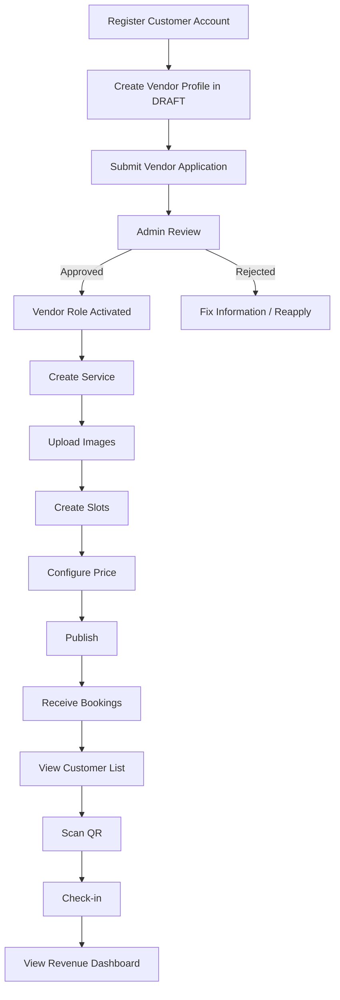

---

# 66. Vendor Application Journey

Trước khi nộp application, Customer mở:

```text
/vendor/profile
```

Nếu chưa có hồ sơ, tạo Vendor `DRAFT`. User có thể xem và chỉnh sửa thông tin
tổ chức của chính mình. `Vendor entity`, `UserProfile`, và `VENDOR role` là ba
khái niệm độc lập; tạo hồ sơ không tự động cấp role hoặc phê duyệt Vendor.

Sau khi hồ sơ sẵn sàng, User mở:

```text
/vendor/application
```

User submit hồ sơ hiện tại, sau đó chọn loại giấy tờ và upload tối đa 5 file
PDF/JPG/PNG, mỗi file tối đa 5 MB. Tài liệu chỉ được đọc qua protected API bởi
Vendor owner hoặc ADMIN.

Application mới:

```text
PENDING
```

---

# 67. Vendor Application Happy Path

```text
Customer
↓
Submit Application
↓
PENDING
↓
Admin Reviews
↓
APPROVED
↓
Vendor record active
↓
User receives VENDOR role
↓
History records PENDING → APPROVED
```

---

# 68. Duplicate Application Error

Nếu user đã có:

```text
PENDING
```

application:

```text
409 APPLICATION_ALREADY_PENDING
```

Không tạo application mới.

---

# 69. Rejected Application

Nếu:

```text
REJECTED
```

UI hiển thị:

```text
reason
```

User có thể:

```text
edit Vendor profile
resubmit as a NEW application
```

Application cũ và rejection reason vẫn nằm trong timeline. Resubmit đồng bộ
Vendor về `PENDING`; Admin có thể review application mới độc lập.

Admin mở `/admin/vendor-applications`, filter theo status, xem Vendor profile,
document metadata/download và timeline. Approve cần confirmation. Reject yêu
cầu lý do không rỗng. Mọi transition được ghi append-only history.

---

# 70. Vendor Approval Requirement

Vendor chỉ được:

```text
Create Service
Publish Service
Create Slot
View Vendor Dashboard
```

nếu:

```text
Vendor.status = APPROVED
```

---

# 71. Vendor Service Creation

Vendor mở:

```text
/vendor/services/new
```

Điền:

```text
name
category
description
address
images
```

Initial:

```text
DRAFT
```

---

# 72. Service Creation Happy Path

```text
Vendor
↓
Create Draft
↓
Upload Image
↓
Create Slots
↓
Configure Pricing
↓
Review
↓
Publish
```

---

# 73. Publish Validation

Trước publish:

```text
name exists
description exists
category exists
address exists
vendor approved
at least one active slot
```

Nếu thiếu:

```text
400 SERVICE_NOT_READY
```

UI phải chỉ rõ thiếu field nào.

---

# 74. Vendor Ownership

Vendor A không được:

```text
GET private Vendor B resource
PATCH Vendor B service
DELETE Vendor B slot
CHECK-IN Vendor B ticket
```

Response:

```text
403
```

hoặc:

```text
404
```

nếu muốn tránh resource enumeration.

---

# 75. Create Slot Journey

Vendor:

```text
Open Service
↓
Add Slot
↓
Set Start
↓
Set End
↓
Set Capacity
↓
Set Price
↓
Save
```

---

# 76. Slot Validation

```text
start < end
start > current time
capacity > 0
price >= 0
```

---

# 77. Slot Update Rule

Nếu:

```text
confirmed quantity = 8
```

Vendor không được set:

```text
capacity = 5
```

Response:

```text
409 CAPACITY_BELOW_CONFIRMED
```

---

# 78. Slot Deletion Rule

Slot chưa có booking:

```text
hard delete possible
```

nhưng khuyên vẫn soft delete.

Slot đã có booking:

```text
DISABLED
```

Không xóa lịch sử.

---

# 79. Vendor Booking Management

Vendor mở:

```text
/vendor/bookings
```

Tabs:

```text
Upcoming
Completed
Cancelled
```

Có thể filter:

```text
date
service
status
booking code
```

---

# 80. Vendor Booking Detail

Vendor xem:

```text
booking code
customer name
service
slot
quantity
ticket status
booking status
```

Không cần xem:

```text
password
private payment secret
full gateway credentials
```

---

# 81. Vendor Check-in Flow

Vendor chọn:

```text
Check-in
```

Camera scanner hoặc nhập code.

Flow:

```text
Scan
↓
Verify
↓
Display Ticket
↓
Confirm
↓
CHECKED_IN
```

Có thể auto check-in khi scan trong MVP nếu validation pass.

---

# 82. Vendor Voucher Journey

Vendor mở:

```text
/vendor/vouchers
```

Create:

```text
code
type
value
start
end
usage limit
per-user limit
minimum order
maximum discount
```

---

# 83. Voucher Validation Rule

Vendor không thể tạo:

```text
percentage > 100
negative discount
end before start
usage <= 0
```

---

# 84. Vendor Dashboard Journey

Vendor mở:

```text
/vendor/dashboard
```

System hiển thị:

```text
Gross Revenue
Platform Fee
Vendor Revenue
Total Bookings
Confirmed Bookings
Cancelled Bookings
Occupancy Rate
Cancellation Rate
```

---

# 85. Dashboard Business Rule

Chỉ tính transaction:

```text
Payment SUCCESS
```

Không tính:

```text
FAILED
PENDING
EXPIRED
```

Refund phải được phản ánh theo rule tài chính đã định nghĩa.

---

# 86. Vendor End-to-End Happy Path

```text
Register
↓
Vendor Application
↓
Admin Approve
↓
Create Service
↓
Create Slot
↓
Publish
↓
Customer Booking
↓
Customer Payment
↓
Vendor sees Booking
↓
Scan Ticket
↓
Customer Check-in
↓
Revenue Dashboard
```

---

# 87. Tổng quan Admin Journey

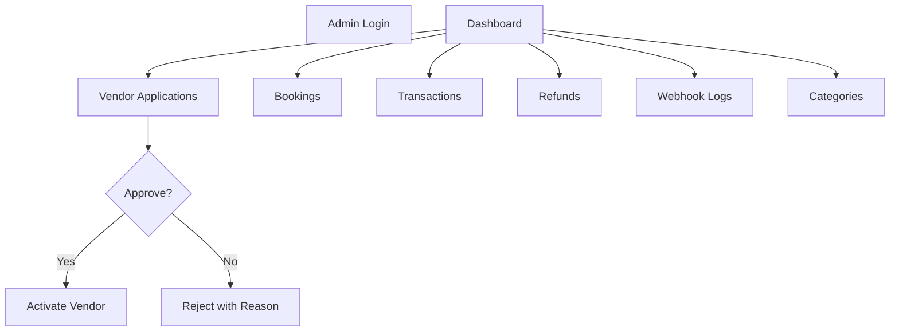

---

# 88. Admin Login

Admin sử dụng cùng auth system.

Role requirement:

```text
ADMIN
```

Không tạo public:

```text
/admin/register
```

MVP Admin account được:

```text
seed
```

hoặc manually provisioned.

---

# 89. Vendor Review Journey

Admin mở:

```text
/admin/vendors
```

Filter:

```text
PENDING
APPROVED
REJECTED
```

---

# 90. Vendor Approval Happy Path

```text
Admin
↓
Open Application
↓
Review Data
↓
Approve
↓
Application APPROVED
↓
Vendor APPROVED
↓
User gets VENDOR
↓
Audit Log
↓
Email Notification
```

Transaction nên bảo đảm các thay đổi liên quan nhất quán.

---

# 91. Vendor Reject Flow

Admin nhập:

```text
reason
```

System:

```text
Application → REJECTED
```

Không activate Vendor role.

---

# 92. Admin Category Management

Admin có thể:

```text
Create
Rename
Hide
```

Category đang được Service sử dụng không nên hard delete.

---

# 93. Admin Booking Inspection

Admin mở:

```text
/admin/bookings/{id}
```

Xem:

```text
Booking
Booking Items
Reservation
Payment
Payment Attempts
Tickets
Refund
Audit Logs
```

Mục tiêu:

```text
debug được toàn bộ lifecycle
```

---

# 94. Admin Transaction Journey

Admin mở:

```text
/admin/transactions
```

Có thể search:

```text
booking code
payment id
gateway transaction
customer
status
date
```

---

# 95. Admin Payment Investigation

Ví dụ Customer báo:

```text
Tôi đã thanh toán nhưng chưa có vé.
```

Admin thực hiện:

```text
Search Booking Code
↓
View Booking
↓
View Payment
↓
View Attempts
↓
View VNPay Transaction ID
↓
View Webhook Log
↓
Check Signature
↓
Check Amount
↓
Check State
```

---

# 96. Payment Investigation Example

```text
Booking:
EXPIRED

Payment:
NEEDS_REVIEW

Gateway:
SUCCESS

Webhook:
Late Callback
```

Admin biết đây là:

```text
Late Payment Success
```

không phải lỗi ticket generator.

---

# 97. Admin Refund Monitoring

Admin xem:

```text
PENDING
PROCESSING
SUCCESS
FAILED
```

Refund FAILED:

```text
needs manual attention
```

---

# 98. Admin Webhook Log

Admin có thể inspect:

```text
provider
receivedAt
transactionRef
signatureValid
processingStatus
error
```

Payload nhạy cảm phải được mask nếu cần.

---

# 99. Admin Audit Trail

Các action bắt buộc log:

```text
approve vendor
reject vendor
manual status action if any
refund handling
category management
```

Audit không được edit bằng UI.

---

# 100. Role Permission Matrix

| Feature | Customer | Vendor | Admin |
|---|---:|---:|---:|
| Browse Services | Yes | Yes | Yes |
| Create Booking | Yes | Yes as Customer | No need |
| View Own Booking | Yes | Yes | Yes |
| View Other Customer Booking | No | Only related vendor | Yes |
| Apply Vendor | Yes | - | No |
| Create Service | No | Yes | No |
| Edit Own Service | No | Yes | No |
| Edit Other Vendor Service | No | No | No |
| Manage Slot | No | Yes | No |
| Check-in | No | Own Service | Yes/Optional |
| Create Voucher | No | Yes | Optional |
| Approve Vendor | No | No | Yes |
| View All Transactions | No | No | Yes |
| Manage Category | No | No | Yes |

---

# 101. Booking Business Rules

## BR-BKG-001

Booking phải thuộc một Customer.

## BR-BKG-002

Booking phải snapshot giá.

## BR-BKG-003

Backend tự tính tổng tiền.

## BR-BKG-004

Frontend không quyết định availability.

## BR-BKG-005

Booking chỉ confirm sau verified payment.

## BR-BKG-006

Booking expired không được tự động resurrect.

## BR-BKG-007

Booking history không hard delete.

---

# 102. Reservation Business Rules

## BR-RES-001

Reservation có expiration time.

## BR-RES-002

Only ACTIVE reservation counts against availability.

## BR-RES-003

Confirmed booking consumes reservation.

## BR-RES-004

Expired reservation giải phóng capacity.

## BR-RES-005

Reservation creation phải concurrency safe.

---

# 103. Payment Business Rules

## BR-PAY-001

Payment amount lấy từ database.

## BR-PAY-002

Return URL không confirm payment.

## BR-PAY-003

IPN phải verify signature.

## BR-PAY-004

Amount phải match.

## BR-PAY-005

Callback phải idempotent.

## BR-PAY-006

Một booking có thể có nhiều payment attempts.

## BR-PAY-007

Chỉ một successful final payment được tính.

---

# 104. Ticket Business Rules

## BR-TKT-001

Ticket chỉ sinh khi booking confirmed.

## BR-TKT-002

QR token phải unique.

## BR-TKT-003

Ticket không chứa PII trong QR.

## BR-TKT-004

Ticket chỉ check-in một lần.

## BR-TKT-005

Vendor chỉ check-in ticket thuộc service của mình.

---

# 105. Voucher Business Rules

## BR-VOU-001

Voucher validation luôn thực hiện backend.

## BR-VOU-002

Voucher usage phải concurrency safe.

## BR-VOU-003

Voucher không làm order amount âm.

Ví dụ:

```text
Order = 50,000
Voucher = 100,000
```

Total:

```text
0
```

không phải:

```text
-50,000
```

---

# 106. Money Calculation Order

Khuyên sử dụng:

```text
subtotal
↓
discount
↓
gross
↓
platform fee
↓
vendor amount
```

Ví dụ:

```text
Subtotal        1,000,000
Discount          100,000
Gross             900,000
Commission 10%     90,000
Vendor Amount     810,000
```

---

# 107. Cancellation Business Rules

## BR-CAN-001

Cancellation policy được snapshot.

## BR-CAN-002

Refund amount được backend tính.

## BR-CAN-003

Cancel booking phải invalidate ticket.

## BR-CAN-004

Refund failure không restore ticket.

## BR-CAN-005

Completed booking không customer-cancel.

---

# 108. Review Business Rules

## BR-REV-001

Only COMPLETED booking can review.

## BR-REV-002

Review owner phải là booking customer.

## BR-REV-003

Maximum one review per booking.

---

# 109. Vendor Business Rules

## BR-VEN-001

Vendor phải APPROVED để publish.

## BR-VEN-002

Vendor chỉ quản lý resource của mình.

## BR-VEN-003

Rejected Vendor không có vendor privileges.

---

# 110. Admin Business Rules

## BR-ADM-001

Admin action quan trọng phải audit.

## BR-ADM-002

Admin không được sửa arbitrary payment amount.

## BR-ADM-003

Admin phải có khả năng trace booking → payment → webhook → ticket.

---

# 111. Error Response Convention

API lỗi nên có format thống nhất:

```json
{
  "statusCode": 409,
  "code": "INSUFFICIENT_CAPACITY",
  "message": "Not enough capacity for this slot",
  "requestId": "req_xxx"
}
```

---

# 112. Common Error Codes

```text
INVALID_CREDENTIALS

EMAIL_ALREADY_EXISTS

FORBIDDEN

RESOURCE_NOT_FOUND

VENDOR_NOT_APPROVED

SERVICE_NOT_PUBLISHED

SLOT_NOT_AVAILABLE

INSUFFICIENT_CAPACITY

BOOKING_EXPIRED

INVALID_BOOKING_STATE

PAYMENT_ALREADY_COMPLETED

PAYMENT_AMOUNT_MISMATCH

INVALID_PAYMENT_SIGNATURE

PAYMENT_NEEDS_REVIEW

INVALID_VOUCHER

VOUCHER_EXPIRED

VOUCHER_USAGE_EXCEEDED

INVALID_TICKET

ALREADY_CHECKED_IN

TICKET_CANCELLED
```

---

# 113. HTTP Status Convention

```text
200
Successful read/update

201
Created

400
Invalid input

401
Unauthenticated

403
Not allowed

404
Resource not found

409
State/business conflict

422
Optional for semantic validation

429
Rate limited

500
Unexpected server error
```

---

# 114. Customer Error Journey Summary

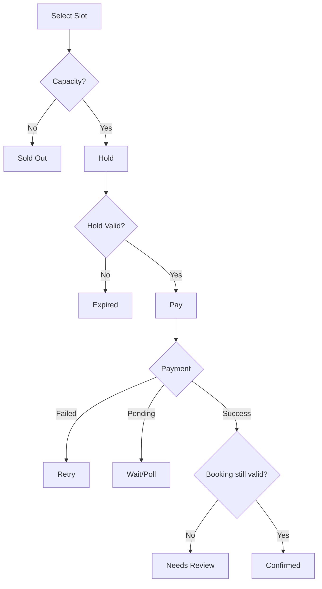

---

# 115. Vendor Error Journey Summary

```text
Application rejected
→ Fix application

Vendor suspended/not approved
→ Cannot publish

Invalid slot
→ Correct schedule

Capacity below booked seats
→ Reject update

Ticket not owned
→ Reject check-in

Ticket already used
→ Show prior check-in
```

---

# 116. Admin Error Journey Summary

```text
Payment mismatch
→ NEEDS_REVIEW

Late callback
→ NEEDS_REVIEW

Refund failed
→ Manual review

Duplicate callback
→ Ignore side effect

Invalid webhook signature
→ Reject + log
```

---

# 117. Frontend Loading States

Mọi flow quan trọng cần có:

```text
idle
loading
success
error
```

Button payment:

```text
Không cho double click tạo nhiều payment attempts không cần thiết.
```

---

# 118. Frontend Empty States

Cần thiết kế empty state cho:

```text
No bookings
No services
No slots
No transactions
No vendor applications
No reviews
```

---

# 119. Frontend Confirmation Dialogs

Cần confirmation cho:

```text
Cancel Booking
Disable Slot
Hide Service
Reject Vendor
```

Không nhất thiết cần với:

```text
Search
Filter
Open Ticket
```

---

# 120. Session Expiration Journey

Nếu Access Token expire:

```text
API 401
↓
Frontend attempts refresh
↓
Refresh success
→ Retry request
```

Nếu Refresh Token fail:

```text
Logout
↓
Login screen
```

Không mất checkout context nếu frontend có thể giữ an toàn.

---

# 121. Service Becomes Hidden During Checkout

Scenario:

```text
Customer viewing service
Vendor hides service
Customer then clicks book
```

Backend phải validate lại.

Nếu không cho booking:

```text
SERVICE_NOT_AVAILABLE
```

Không dựa vào page đã load trước đó.

---

# 122. Slot Disabled During Checkout

Tương tự:

```text
Customer sees slot
Vendor disables slot
Customer attempts hold
```

Backend:

```text
reject
```

---

# 123. Price Changes During Checkout

Customer đang xem:

```text
200,000
```

Vendor đổi:

```text
250,000
```

trước khi Customer hold.

Khi hold:

```text
backend current price = 250,000
```

Response phải trả snapshot mới.

Frontend nên cảnh báo:

```text
Giá đã thay đổi.
```

nếu khác giá đang hiển thị.

Sau hold:

```text
price frozen
```

cho booking đó.

---

# 124. Voucher Expires During Checkout

Nếu voucher hợp lệ lúc UI preview nhưng hết hạn trước hold:

backend:

```text
reject voucher
```

Customer có thể:

```text
continue without voucher
```

hoặc chọn voucher khác.

---

# 125. Booking Already Paid

Customer double click payment sau success.

Backend thấy:

```text
Booking CONFIRMED
```

Response:

```text
PAYMENT_ALREADY_COMPLETED
```

Frontend redirect booking success.

Không tạo payment attempt mới.

---

# 126. Customer Refresh Payment Result Page

Refresh nhiều lần:

```text
GET current payment status
```

Không gây side effect.

---

# 127. Customer Opens Two Checkout Tabs

Cả hai tab cùng booking.

Nếu tab A thanh toán success:

```text
Booking CONFIRMED
```

Tab B bấm pay:

```text
reject new payment
```

hoặc redirect success.

---

# 128. Vendor Modifies Slot After Booking

Vendor có thể thay:

```text
description
```

nhưng các dữ liệu booking history phải dùng snapshot.

Không được khiến ticket cũ hiển thị sai lịch sử.

---

# 129. Vendor Hides Service with Upcoming Booking

Allowed:

```text
Yes
```

Existing confirmed bookings vẫn valid.

Hide chỉ:

```text
prevent new booking
```

Không tự cancel booking cũ.

---

# 130. Vendor Disables Slot with Confirmed Booking

Không nên cho disable theo nghĩa invalidate booking.

System phải:

```text
warn vendor
```

Nếu cần cancel event hàng loạt, đó là flow riêng ngoài MVP hoặc xử lý admin/vendor cancellation có controlled workflow.

---

# 131. Completion Flow

Sau khi slot/service kết thúc:

Booking có thể transition:

```text
CONFIRMED
↓
COMPLETED
```

MVP có thể dùng scheduled job:

```text
slot.end_time passed
```

sau grace period.

---

# 132. Auto Complete Rule

Không nên mark COMPLETED ngay tại `end_time` nếu cần xử lý trễ.

Có thể:

```text
end_time + 30 minutes
```

hoặc simple:

```text
end_time passed
```

cho MVP.

Rule phải config/document rõ.

---

# 133. Review Availability

Khi:

```text
Booking COMPLETED
```

UI hiện:

```text
Write Review
```

Trước đó:

```text
hidden/disabled
```

---

# 134. End-to-End Business Lifecycle

```mermaid
flowchart LR
    A[Vendor Approved]
    B[Service Published]
    C[Slot Available]
    D[Reservation Active]
    E[Booking Pending Payment]
    F[Payment Success]
    G[Booking Confirmed]
    H[Ticket Active]
    I[Ticket Checked In]
    J[Booking Completed]
    K[Review]

    A --> B --> C --> D --> E --> F --> G --> H --> I --> J --> K
```

---

# 135. Critical Invariants

Các điều kiện sau luôn phải đúng.

## INV-001

```text
confirmed + active reservations <= capacity
```

## INV-002

Một successful gateway transaction không được xử lý hai lần.

## INV-003

Booking CONFIRMED phải có verified successful payment.

## INV-004

Ticket ACTIVE/CHECKED_IN phải thuộc booking CONFIRMED/COMPLETED.

## INV-005

CANCELLED Ticket không được check-in.

## INV-006

Customer không truy cập booking của Customer khác.

## INV-007

Vendor không thao tác resource của Vendor khác.

## INV-008

Money history không thay đổi theo config mới.

---

# 136. Critical Race Conditions

Hệ thống phải đặc biệt test:

```text
Two customers hold final slot

Expiration vs payment success

Duplicate VNPay callback

Two payment attempts success unexpectedly

Two users consume final voucher

Two devices scan same ticket

Vendor changes capacity while customer holds slot
```

---

# 137. Suggested Order to Convert This Document Into APIs

```text
Auth
↓
Vendor
↓
Category
↓
Service
↓
Slot
↓
Search
↓
Booking
↓
Reservation
↓
Payment
↓
Ticket
↓
Cancellation
↓
Refund
↓
Voucher
↓
Dashboard
↓
Admin
```

---

# 138. Suggested Order to Convert This Document Into UI

```text
Public Search
↓
Service Detail
↓
Auth
↓
Checkout
↓
Payment Result
↓
My Bookings
↓
Ticket

Vendor Application
↓
Vendor Service Management
↓
Slot Management
↓
Booking List
↓
Check-in
↓
Dashboard

Admin Vendor Review
↓
Transaction
↓
Booking Inspection
```

---

# 139. Suggested Core E2E Scenario

Scenario:

```text
Given Vendor A is APPROVED

And Vendor A has Service S

And Slot X:
capacity = 10
price = 200000

When Customer A registers

And Customer A books 2 seats

Then:
reservation = ACTIVE
booking = PENDING_PAYMENT
available = 8

When Customer A successfully pays through VNPay

Then:
payment = SUCCESS
booking = CONFIRMED
reservation = CONSUMED

And:
2 tickets exist

When Vendor A scans Ticket 1

Then:
Ticket 1 = CHECKED_IN

When Vendor A scans Ticket 1 again

Then:
response = ALREADY_CHECKED_IN
```

---

# 140. Suggested Critical Error E2E Scenario

```text
Given Slot capacity = 1

When Customer A and Customer B
hold at the same time

Then exactly one request succeeds

And:
confirmed + held <= 1

And no overselling occurs.
```

---

# 141. Payment Error E2E Scenario

```text
Given Booking A amount = 500000

When callback arrives with amount = 400000

Then:
Booking must NOT become CONFIRMED

Payment must NOT become normal SUCCESS

System logs AMOUNT_MISMATCH

Admin can inspect the incident.
```

---

# 142. Late Payment E2E Scenario

```text
Given Booking expired

And reservation released

When payment SUCCESS callback arrives

Then:

Booking remains EXPIRED

No ticket created

Payment marked for review

No capacity is consumed.
```

---

# 143. Definition of User Flow Complete

User Flow của MVP được xem là đã được xác định đầy đủ khi:

```text
Customer Happy Path documented
Customer Error Paths documented

Vendor Happy Path documented
Vendor Error Paths documented

Admin Happy Path documented
Admin Error Paths documented

Booking lifecycle documented
Reservation lifecycle documented
Payment lifecycle documented
Ticket lifecycle documented
Refund lifecycle documented

Permissions documented
Business rules documented
Race conditions documented
Critical E2E scenarios documented
```

---

# 144. Final Product Journey

GoBook MVP phải cho phép quy trình thực tế sau diễn ra hoàn chỉnh:

```text
CUSTOMER
Search
↓
Select Service
↓
Select Slot
↓
Hold
↓
Payment
↓
Ticket
↓
Check-in
↓
Review


VENDOR
Apply
↓
Approved
↓
Create Service
↓
Create Slot
↓
Publish
↓
Receive Booking
↓
Check-in
↓
Revenue


ADMIN
Review Vendor
↓
Approve
↓
Monitor Booking
↓
Monitor Payment
↓
Investigate Problems
```

Nếu toàn bộ ba hành trình trên hoạt động đúng cùng các error path đã định nghĩa, product flow của GoBook MVP được xem là hoàn chỉnh trước khi bước vào implementation.
